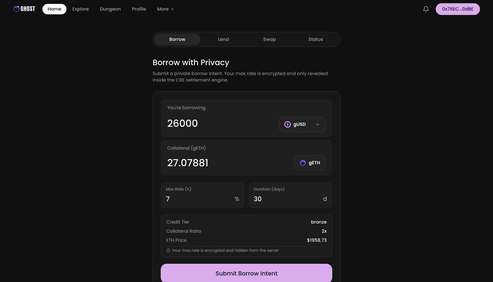

# Ghost Finance

**Privacy preserving peer to peer lending with sealed bid rate discovery on Chainlink CRE.**

GHOST (Generalized Heuristic for Obfuscated Settlement and Transfer) is a decentralized lending protocol where interest rates are determined through sealed bid discriminatory price auctions. Lenders submit encrypted rate bids that only the Chainlink Confidential Runtime Environment can decrypt, preventing front running and ensuring truthful price discovery. Each lender earns their individual bid rate rather than a blended pool rate, eliminating the free rider problem that plagues traditional DeFi lending.

<p align="center">
  
</p>

## Architecture

GHOST separates concerns across three independent trust domains:

| Layer | Role | Trust Property |
|-------|------|----------------|
| **Custody** | Chainlink Compliant Private Transfer vault on Sepolia | Funds move only via user action or valid DON threshold signature |
| **Blind Storage** | GHOST API server (Hono + Bun + MongoDB) | Stores encrypted intents; cannot decrypt rates or move funds |
| **Settlement Engine** | Chainlink CRE (TEE) | Decrypts rates, runs matching, executes transfers; key material wiped after each cycle |

The server is a dumb blob store. It holds encrypted rate bids but has no decryption key. Even a fully compromised server cannot learn any plaintext lending rate or move any user funds.

## Key Mechanisms

**Sealed Bid Auctions.** Lenders encrypt their rate bids using ECIES on secp256k1 with the CRE public key. The CRE decrypts all bids inside the TEE during each 30 second matching epoch, runs the greedy fill algorithm, and discards plaintext rates after matching.

**Discriminatory Pricing.** Each lender earns their own bid rate. A lender who bids 3.5% earns 3.5% on their matched amount, regardless of what other lenders bid. This incentivizes truthful bidding and eliminates rate manipulation.

**Tick Based Rate Discovery.** Borrower demand is filled starting from the cheapest available lender tick and moving up. The borrower pays a blended rate across all matched ticks. If the blended rate exceeds their maximum, the match is rejected.

**Credit Tiers.** An endogenous credit system (Bronze through Platinum) reduces collateral requirements from 2.0x to 1.2x as borrowers build repayment history. Defaults drop the tier by one level.

**Rejection Penalty.** Borrowers who reject match proposals forfeit 5% of their collateral. This prevents option seeking behavior where borrowers use proposals as free rate discovery.

## Repository Structure

```
ghost/
  server/               Hono API server (Bun runtime, MongoDB)
  ghost-settler/
    settle-loans/       CRE matching engine (30s epoch)
    execute-transfers/  CRE fund executor (15s cycle)
    check-loans/        CRE health monitor (60s cycle)
  client/               Next.js application frontend
  frontend/             Next.js marketing site
  ghost-tg/             Telegram bot (grammY)
  ghost-raycast/        Raycast extension
  e2e-test/             End to end integration tests
  transfer-demo/        Foundry smart contracts (SimpleToken, GhostSwapPool)
  reference-docs/       Architecture documents and litepaper
  docs/                 Docusaurus documentation site
```

## Tech Stack

| Component | Technology |
|-----------|------------|
| Runtime | Bun |
| Server | Hono |
| Database | MongoDB (Mongoose) |
| Confidential Compute | Chainlink CRE SDK |
| Encryption | eciesjs v0.4 (secp256k1 ECIES, WASM compatible) |
| Authentication | EIP 712 typed data signatures |
| Price Feeds | Chainlink Data Streams (ETH/USD) |
| Chain | Ethereum Sepolia (11155111) |
| Smart Contracts | Foundry (Solidity) |
| Frontend | Next.js 15, React 19, Tailwind CSS |

## Tokens

| Token | Symbol | Address (Sepolia) | Role |
|-------|--------|-------------------|------|
| Ghost USD | gUSD | `0xD318551FbC638C4C607713A92A19FAd73eb8f743` | Lending denomination |
| Ghost ETH | gETH | `0x81aF9668d4a67AeDFD43bF38787debA8FD33cbA6` | Borrower collateral |

Both are ERC20 + ERC20Permit tokens deployed via the `SimpleToken` contract. The vault address is `0xE588a6c73933BFD66Af9b4A07d48bcE59c0D2d13`.

## Quick Start

### Prerequisites

- [Bun](https://bun.sh) (latest)
- MongoDB 7.x+
- Chainlink CRE CLI (`npm i -g @chainlink/cre-cli`)

### Server

```bash
cd server
bun install
cp .env.example .env  # configure environment variables
bun run --hot src/index.ts
```

The server starts on port 3000 (configurable). Verify with `curl http://localhost:3000/health`.

### CRE Workflows

```bash
cd ghost-settler/settle-loans && bun install
cd ../execute-transfers && bun install
cd ../check-loans && bun install
```

Simulate a workflow:

```bash
cd ghost-settler
cre workflow simulate ./settle-loans \
  --target=staging-settings \
  --non-interactive \
  --trigger-index=0
```

### E2E Tests

```bash
cd e2e-test
bun install
bun run src/01_transfer-funds.ts
bun run src/02_submit-intents.ts
bun run src/03_trigger-matching.ts
bun run src/04_settlement.ts
```

### Documentation Site

```bash
cd docs
bun install
bun run start
```

## CRE Workflows

Three cron triggered workflows run inside the Chainlink DON:

| Workflow | Interval | What It Does |
|----------|----------|-------------|
| `settle-loans` | 30s | Expires stale proposals, fetches pending intents, decrypts rates inside TEE, runs greedy matching (cheapest lends first, largest borrows first), posts proposals to server |
| `execute-transfers` | 15s | Polls pending transfers, signs each with pool wallet via EIP 712, submits to vault private transfer API, confirms execution (max 3 per cycle due to 5 call budget) |
| `check-loans` | 60s | Reads ETH/USD from Chainlink feed on Arbitrum, computes health factor for each active loan, triggers liquidation for positions below 1.5x or past maturity |

## API Endpoints

### User Facing (EIP 712 authenticated)

| Method | Path | Description |
|--------|------|-------------|
| POST | `/api/v1/deposit-lend/init` | Initialize deposit slot (10 min TTL) |
| POST | `/api/v1/deposit-lend/confirm` | Confirm with encrypted rate bid |
| POST | `/api/v1/cancel-lend` | Cancel lend intent, queue fund return |
| POST | `/api/v1/borrow-intent` | Submit borrow with collateral |
| POST | `/api/v1/cancel-borrow` | Cancel borrow, return collateral |
| POST | `/api/v1/accept-proposal` | Accept match, create loan |
| POST | `/api/v1/reject-proposal` | Reject match, 5% penalty |
| POST | `/api/v1/repay` | Repay loan in full |
| GET | `/api/v1/credit-score/:address` | Query credit tier |
| GET | `/api/v1/collateral-quote` | Get collateral requirement |

### Internal (x-api-key authenticated, CRE only)

| Method | Path | Description |
|--------|------|-------------|
| GET | `/api/v1/internal/pending-intents` | Fetch unmatched intents |
| POST | `/api/v1/internal/record-match-proposals` | Submit match results |
| POST | `/api/v1/internal/expire-proposals` | Auto accept timed out proposals |
| GET | `/api/v1/internal/pending-transfers` | Fetch transfer queue |
| POST | `/api/v1/internal/confirm-transfers` | Mark transfers complete |
| POST | `/api/v1/internal/liquidate-loans` | Trigger liquidation |

## Privacy Model

| Data | Server | CRE (TEE) | On Chain |
|------|--------|-----------|----------|
| Lending rates | Ciphertext only | Plaintext during matching (ephemeral) | Never visible |
| Loan amounts | Visible | Visible | Vault level only |
| Addresses | Visible | Visible | Vault level only |
| Credit scores | Visible | Visible | Not visible |
| Collateral ratios | Derivable | Visible | Not visible |

The CRE private key is split across DON nodes via threshold secret sharing. No single node can reconstruct the key or decrypt rate bids unilaterally.

## Credit Tiers

| Tier | Collateral Multiplier | Upgrade | Downgrade |
|------|----------------------|---------|-----------|
| Bronze | 2.0x | Default | N/A |
| Silver | 1.8x | Repay from Bronze | Default from Silver |
| Gold | 1.5x | Repay from Silver | Default from Gold |
| Platinum | 1.2x | Repay from Gold | Default from Platinum |

## Client Interfaces

| Interface | Stack | Entry Point |
|-----------|-------|-------------|
| Web App | Next.js 15, Privy wallet | `client/` |
| Marketing Site | Next.js 15, Framer Motion | `frontend/` |
| Telegram Bot | grammY, WalletConnect v2 | `ghost-tg/` |
| Raycast Extension | Raycast API, React 19 | `ghost-raycast/` |

## Documentation

Full documentation is available in the `docs/` directory (Docusaurus). Run `cd docs && bun run start` to view locally. Topics covered:

- Three layer architecture and trust model
- Tick based rate discovery and sealed bid auctions
- Matching engine algorithm and collateral system
- Incentive design (rejection penalty, credit tiers, liquidation)
- Complete API reference
- CRE workflow specifications
- Data models and transfer reasons
- Production smart contract design (GhostVault)
- ZK vault roadmap (Pedersen commitments, ZK circuits)

## References

- Eli, A. and Alexandre, D. (2025). "Tick-Based Lending Pools with Discriminatory Rate Matching"
- Chainlink CRE SDK Documentation
- EIP 712: Typed structured data hashing and signing
- ECIES on secp256k1 (eciesjs)

## License

Apache License 2.0
