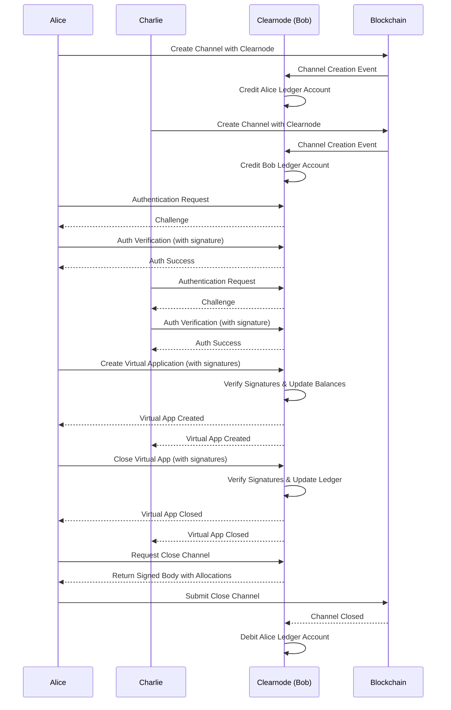

[](https://codecov.io/github/erc7824/nitrolite)
[](https://pkg.go.dev/github.com/erc7824/nitrolite/clearnode)
[](https://goreportcard.com/report/github.com/erc7824/nitrolite/clearnode)

# Clearnode

Clearnode is an implementation of a message broker node providing ledger services for the Clearnet protocol, which enables efficient off-chain payment channels with on-chain settlement capabilities for fast payment channel applications. This system allows participants to conduct transactions without requiring on-chain operations for every exchange, significantly reducing transaction costs and improving efficiency.

## Features

- **Multi-Chain Support**: Connect to multiple EVM blockchains with YAML-based configuration
- **Off-Chain Payments**: Efficient payment channels for high-throughput transactions
- **Virtual Applications**: Create multi-participant applications
- **Message Forwarding**: Bi-directional message routing between application participants
- **Flexible Database**: Support for both PostgreSQL and SQLite
- **Prometheus Metrics**: Built-in monitoring and telemetry
- **Quorum-Based Signatures**: Support for multi-signature schemes with weight-based quorums

### Communication Protocol

- [Protocol Specification](docs/Clearnode.protocol.md): Describes the protocol architecture and message format
- [API Reference](docs/API.md): Detailed API endpoint documentation



## Authentication and security Policy

Each websocket connection must be authenticated by signing the Policy struct defined in nitrolite.
Main console scope is `console` and allows superuser access to clearnode administration.
Application must also connect to clearnode with limited scope permissions (`app.create`) to only `create_app_session`
for a specific application address, a maximum allocation limit and register and assign the participant session key
with an expiration date.

`create_app_session` must verify:

- Policy scope allow to create app
- Wallet in allocation match with policy wallet address
- The application address match with the policy value
- Allocation is within the permitted policy Allowance
- Participant address from policy is in the first value of app participant array

```solidity
struct Policy {
    string challenge; // Unique challenge identifier (UUID format)
    string scope; // Permission scope (e.g., "app.create", "ledger.readonly")
    address wallet; // Main wallet address authorizing the session
    address application; // Application public address
    address participant; // Delegated session key address
    uint256 expires_at; // Expiration timestamp
    Allowance[] allowances; // Array of asset allowances
}
```

Once authenticated, a JWT is return for session persistence:

```typescript
type JWTClaims struct {
 Scope       string      `json:"scope"`       // Permission scope (e.g., "app.create", "ledger.readonly")
 Wallet      string      `json:"wallet"`      // Main wallet address authorizing the session
 Participant string      `json:"participant"` // Delegated session key address
 Application string      `json:"application"` // Application public address
 Allowances  []Allowance `json:"allowance"`   // Array of asset allowances
 jwt.RegisteredClaims
}
```

## Go Documentation

### Package Structure

- **main.go**: Application entry point, service initialization
- **config.go**: Configuration loading and environment variable handling
- **auth.go**: Authentication challenge generation and verification
- **ws.go**: WebSocket connection and message handling
- **ledger.go**: Double-entry accounting and balance management
- **channel.go**: Payment channel state management
- **rpc.go**: RPC protocol implementation and message format
- **custody.go**: Blockchain integration for channel monitoring
- **eth_listener.go**: Ethereum event listeners for custody contracts
- **signer.go**: Cryptographic operations for message signing
- **handlers.go**: RPC method handlers and business logic
- **metrics.go**: Prometheus metrics collection

### Key Interfaces

#### Ledger Interface

The ledger system manages financial transactions between accounts using double-entry accounting principles:

## Blockchain Configuration

Clearnode uses a YAML-based configuration system for managing blockchain connections and contract addresses. The configuration file `blockchains.yaml` should be placed in your configuration directory.

See example configuration: [`config/compose/example/blockchains.yaml`](config/compose/example/blockchains.yaml)

### Configuration Structure

- **default_contract_addresses**: Default contract addresses applied to all blockchains unless overridden
  - `custody`: Custody contract address
  - `adjudicator`: Adjudicator contract address
  - `balance_checker`: Balance checker contract address

- **blockchains**: Array of blockchain configurations. You can add as many blockchains as needed.
  - `name`: Blockchain name (required; lowercase, underscores allowed)
  - `id`: Chain ID for validation (required)
  - `disabled`: Whether to connect to this blockchain
  - `block_step`: Block range for scanning (optional, default: 10000)
  - `contract_addresses`: Override default addresses as needed

## Asset Configuration

Clearnode uses a YAML-based configuration system for managing assets and their token implementations across different blockchains. The configuration file `assets.yaml` should be placed in your configuration directory.

See example configuration: [`config/compose/example/assets.yaml`](config/compose/example/assets.yaml)

### Configuration Structure

- **assets**: Array of asset configurations. Each asset can have multiple token implementations across different blockchains.
  - `name`: Human-readable name of the asset (e.g., "USD Coin")
  - `symbol`: Ticker symbol for the asset (required; e.g., "USDC")
  - `disabled`: Whether to skip processing this asset
  - `tokens`: Array of blockchain-specific token implementations
    - `name`: Token name on this blockchain (optional, inherits from asset)
    - `symbol`: Token symbol on this blockchain (optional, inherits from asset)
    - `blockchain_id`: Chain ID where this token is deployed (required)
    - `disabled`: Whether to skip processing this token
    - `address`: Token's contract address (required)
    - `decimals`: Number of decimal places for the token (required)

### Asset Token Inheritance

Token configurations inherit values from their parent asset:
- If a token's `name` is not specified, it uses the asset's `name`
- If a token's `symbol` is not specified, it uses the asset's `symbol`
- If an asset's `name` is not specified, it defaults to the asset's `symbol`

### Example Configuration

```yaml
assets:
  - name: "USD Coin"
    symbol: "USDC"
    tokens:
      - blockchain_id: 1
        address: "0xA0b86991c6218b36c1d19D4a2e9Eb0cE3606eB48"
        decimals: 6
      - name: "Bridged USDC"
        blockchain_id: 42161
        address: "0xaf88d065e77c8cC2239327C5EDb3A432268e5831"
        decimals: 6
  - symbol: "USDT"
    disabled: true
    tokens:
      - blockchain_id: 1
        address: "0xdAC17F958D2ee523a2206206994597C13D831ec7"
        decimals: 6
```

### RPC Configuration

Each enabled blockchain requires an RPC endpoint configured via environment variables following the pattern:
`<BLOCKCHAIN_NAME_UPPERCASE>_BLOCKCHAIN_RPC`

Example:
```bash
MY_NETWORK_BLOCKCHAIN_RPC=https://my-network-rpc.example.com
ANOTHER_CHAIN_BLOCKCHAIN_RPC=https://another-chain.example.com
```

The system validates that RPC endpoints match the expected chain ID at startup.

## Environment Variables

Clearnode requires the following environment variables to be properly configured:

| Variable | Description | Required | Default |
|----------|-------------|----------|---------|
| `BROKER_PRIVATE_KEY` | Private key used for signing broker messages | Yes | - |
| `DATABASE_DRIVER` | Database driver to use (postgres/sqlite) | No | sqlite |
| `CLEARNODE_CONFIG_DIR_PATH` | Path to directory containing configuration files | No | . |
| `CLEARNODE_DATABASE_URL` | Database connection string | No | clearnode.db |
| `CLEARNODE_LOG_LEVEL` | Logging level (debug, info, warn, error) | No | info |
| `HTTP_PORT` | Port for the HTTP/WebSocket server | No | 8000 |
| `METRICS_PORT` | Port for Prometheus metrics | No | 4242 |
| `MSG_EXPIRY_TIME` | Time in seconds for message timestamp validation | No | 60 |
| `<BLOCKCHAIN_NAME>_BLOCKCHAIN_RPC` | RPC endpoint for each enabled blockchain | Yes (per enabled blockchain) | - |

## Running with Docker

### Quick Start

1. Create a configuration directory:

```bash
cp -r config/compose/example config/compose/local
```

2. Reconfigure `blockchains.yaml` and `assets.yaml` in `config/compose/local` to suit your setup.

3. Set up environment variables in `config/compose/local/.env` file:

```bash
# Required
BROKER_PRIVATE_KEY=your_private_key
# Add RPC endpoints for each enabled blockchain in your config
<BLOCKCHAIN_NAME>_BLOCKCHAIN_RPC=https://your-rpc-endpoint.com
```

### Run locally

```go
go run .
```

### Run with Docker Compose

```bash
docker-compose up
```
