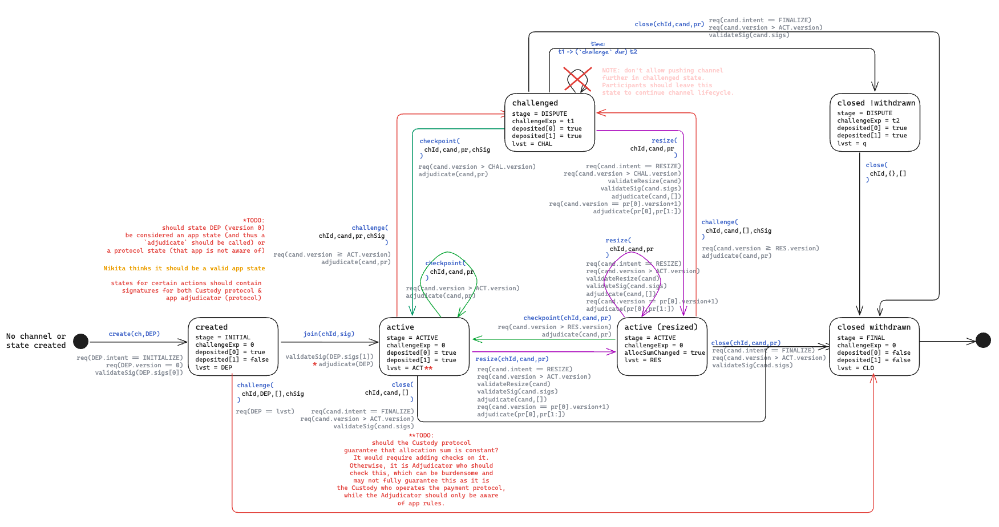

# This document outlines protocol-level security mechanisms

## Custody `IChannel` implementation

### Push-down automaton

Security of the custody implementation is based on a push-down automaton (PDA) that defines the channel lifecycle.
The PDA is defined on the following image:



### Close

- HORIZONTAL: what is the last known on-chain state of a channel being closed
- VERTICAL: what is the status of a channel being closed
- INITIALIZE: an intent showing a state is the first deposit state
- OPERATE: an intent showing a state is operatable
- RESIZE: an intent showing a state is to resize the channel
- FINALIZE: an intent showing a state is final

Here is an overview of possible scenarios a channel might be in while being closed:

|         | INITIALIZE not all joined | INITIALIZE all joined | OPERATE | RESIZE | FINALIZE |
| ------- | ------------------------- | --------------------- | ------- | ------ | -------- |
| INITIAL | ❌                        | ❌                    | ❌      | ❌     | ❌       |
| ACTIVE  | ❌                        | ✅                    | ✅      | ✅     | ❌       |
| DISPUTE | ✅                        | ✅                    | ✅      | ✅     | ❌       |
| FINAL   | ❌                        | ❌                    | ❌      | ❌     | ❌       |

> NOTE: "INITIALIZE not all joined" is after `created`, while "INITIALIZE all joined" is after `join` function call.

> NOTE: it does not matter what state X is in, because as the Final state is signed by all participants, transition to it from the correct status is always valid.

As you can see, the channel can not be finalized when in an INITIAL or already FINAL status or while having FINALIZE state.

Let's review each scenario in detail.
X: an on-chain state the channel is in.
Y: a state the channel is being finalized with.

General rule is that Y must be FINALIZE.
General flow after all checks is:

- `meta.lastValidState = Y`
- `meta.status = FINAL`
- `unlock all allocations`
- `remove channel from participants legders`
- ...

#### ACTIVE status

> The main goal: to verify Y is signed by all participants and is a valid FINALIZE state.

```md
- verify Y is a valid FINALIZE state (has FINALIZE intent)
  verify Y has valid signatures from all participants
```

#### DISPUTE status

> The main goal: either close the channel after challenge or finalize the channel during challenge.

```md
- if if block.timestamp < meta.challengeExpire:
  - verify Y is a valid FINALIZE state (has FINALIZE intent)
    verify Y has valid signatures from all participants
```

### Challenge

- HORIZONTAL: what is the last known on-chain state of a channel being challenged
- VERTICAL: what is the status of a channel being challenged
- INITIALIZE: an intent showing a state is the first deposit state
- OPERATE: an intent showing a state is operatable
- RESIZE: an intent showing a state is to resize the channel
- FINALIZE: an intent showing a state is final

Here is an overview of possible scenarios a channel might be in while being challenged:

|         | INITIALIZE not all joined | INITIALIZE all joined | OPERATE | RESIZE | FINALIZE |
| ------- | ------------------------- | --------------------- | ------- | ------ | -------- |
| INITIAL | ✅                        | ❌                    | ❌      | ❌     | ❌       |
| ACTIVE  | ❌                        | ✅                    | ✅      | ✅     | ❌       |
| DISPUTE | ❌                        | ❌                    | ❌      | ❌     | ❌       |
| FINAL   | ❌                        | ❌                    | ❌      | ❌     | ❌       |

> NOTE: "INITIALIZE not all joined" is after `created`, while "INITIALIZE all joined" is after `join` function call.

> NOTE: don't allow pushing channel further in challenged state. Participants should leave this state to continue channel lifecycle.

> NOTE: when influencing a channel with `checkpoint` or `challenge`, the current on-chain situation may have changed since the one pointed in by `meta.lastValidState`,
> i.e. some parties may have joined the channel.

As you can see, the channel can not be challenged in a DISPUTE or FINAL status or while having FINALIZE state.

Let's review each scenario in detail.
X: an on-chain state the channel is in.
Y: a state the channel is being challenged with.

General checks:

- !(X != RESIZE && Y == RESIZE). In such case a user should call `resize` function.
- Y is not FINALIZE. In such case a user should call `close` function.

Another almost\* general rule is that after all checks there are the following on-chain changes:

- `meta.status = DISPUTE`
- `meta.lastValidState = Y`
- `meta.challengeExpire = block.timestamp + meta.chan.challenge`

* - the exception is when the channel is in INITIAL status, then the channel is closed and funds are returned to the only joined participant.

#### INITIAL status

> The main goal: to verify Y is valid and >= X.

```md
- verify X is "INITIALIZE"
  verify Y == X
```

#### ACTIVE status

> The main goal: to verify Y is valid and >= X.

```md
- X is "INITIALIZE all joined": // NOTE: even if channel status is ACTIVE, the last valid state still has INITIALIZE intent.
  - if (Y is INITIALIZE):
    - verify Y is a valid INITIALIZE state
      verify Y contains all signatures
      verify all Y signatures are valid
  - else: // Y is OPERATE
    - verify adjudicate(Y, proof)
- X is OPERATE state:
  - verify Y is OPERATE
    if (X != Y):
    - verify isMoreRecent(Y, X)
      verify adjudicate(Y, proof)
- X is RESIZE state:
  - verify Y is NOT INITIALIZE
    if (Y is OPERATE):
    - verify isMoreRecent(Y, X)
      verify adjudicate(Y, proof)
  - else: // Y is RESIZE
    - verify X == Y
```

### Checkpoint

- HORIZONTAL: what is the last known on-chain state of a channel being checkpointed
- VERTICAL: what is the status of a channel being checkpointed
- INITIALIZE: an intent showing a state is the first deposit state
- OPERATE: an intent showing a state is operatable
- RESIZE: an intent showing a state is to resize the channel
- FINALIZE: an intent showing a state is final

Here is an overview of possible scenarios a channel might be in while being checkpointed:

|         | INITIALIZE not all joined | INITIALIZE all joined | OPERATE | RESIZE | FINALIZE |
| ------- | ------------------------- | --------------------- | ------- | ------ | -------- |
| INITIAL | ❌                        | ❌                    | ❌      | ❌     | ❌       |
| ACTIVE  | ❌                        | ❌                    | ✅      | ✅     | ❌       |
| DISPUTE | ❌                        | ✅                    | ✅      | ✅     | ❌       |
| FINAL   | ❌                        | ❌                    | ❌      | ❌     | ❌       |

> NOTE: when influencing a channel with `checkpoint` or `challenge`, the current on-chain situation may have changed since the one pointed in by `meta.lastValidState`,
> i.e. some parties may have joined the channel.

As you can see, the channel can not be checkpointed in a FINAL status or while having FINALIZE state.

Let's review each scenario in detail.
X: an on-chain state the channel is in.
Y: a state the channel is being challenged with.

General checks:

- Y is not INITIALIZE. In such case a user should call `join` function.
- Y is not RESIZE. In such case a user should call `resize` function.
- Y is not FINALIZE. In such case a user should call `close` function.

Another general rule is that after all checks there are the following on-chain changes:

- `meta.status = updatedStatus`, where the latter is determined during checks.
- `meta.lastValidState = Y`

> The main goal: to verify Y is valid and > X.

#### ACTIVE status

```md
- X is OPERATE state:
  - verify isMoreRecent(Y, X)
    verify adjudicate(Y, proof)

updatedStatus = ACTIVE
```

#### DISPUTE status

```md
- X is "INITIALIZE all joined":
  - verify adjudicate(Y, proof)
- X is OPERATE state:
  - verify isMoreRecent(Y, X)
    verify adjudicate(Y, proof)

updatedStatus = ACTIVE
meta.challengeExpire = 0
```
