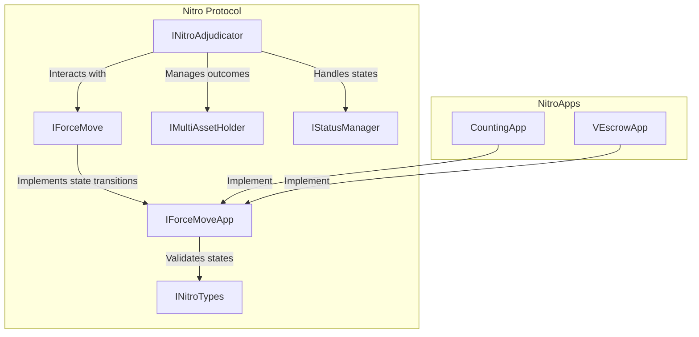
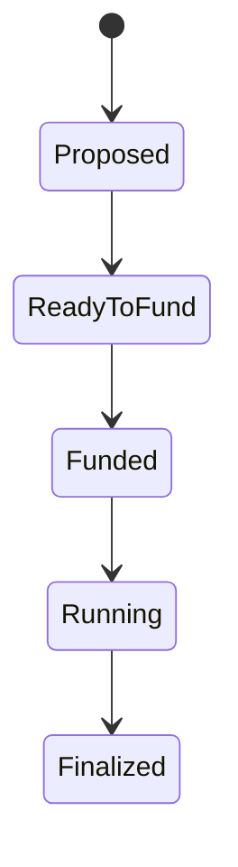
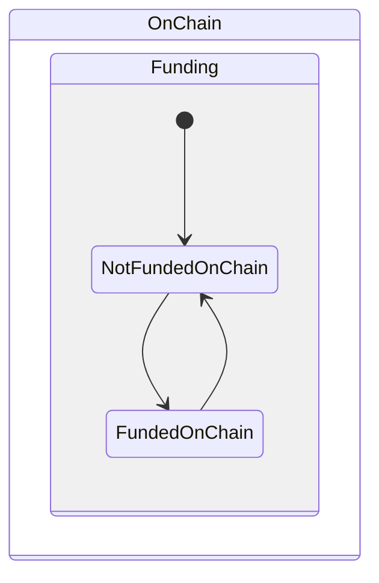
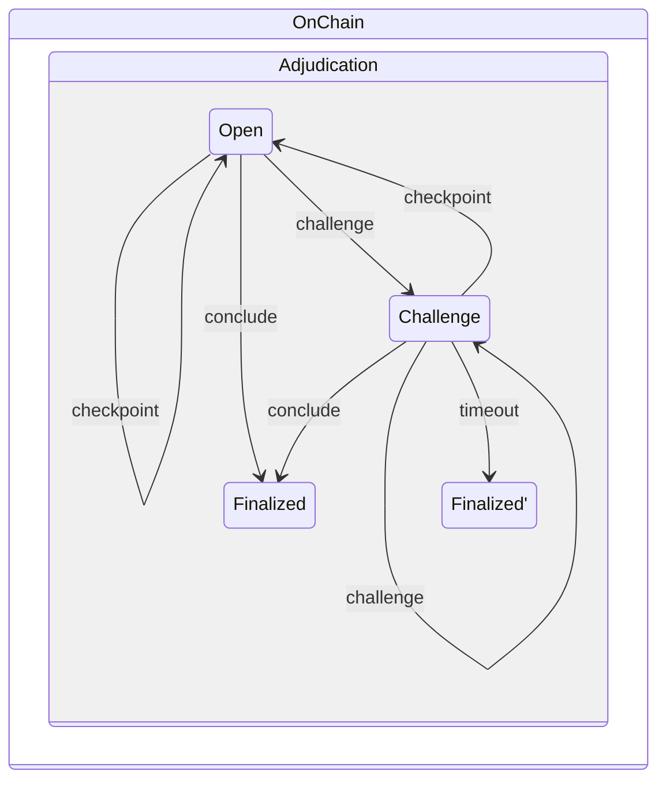

# Nitro Protocol

**Nitro Protocol** is a framework for building fast, secure, and flexible state channels on Ethereum. It enables developers to keep most transactions off-chain for near-instant updates while retaining the option to settle disputes on-chain as a last resort. At the heart of Nitro are well-defined states and transition rules enforced by the on-chain Adjudicator contract. The application-specific logic (“NitroApp”) is encapsulated in an on-chain contract, which the Nitro Adjudicator references during disputes to verify that a proposed state transition is valid.

Off-chain, developers write the code responsible for constructing and signing new states, managing state progression, and orchestrating deposits and withdrawals. This off-chain logic ensures quick state updates without paying on-chain gas fees, since new states only require on-chain submission when there is a disagreement or final payout. By following Nitro’s API and implementing these components carefully, developers can build robust applications that benefit from low latency and trust-minimized on-chain settlements.

## Overview



## 1. States & Channels

A state channel can be thought of as a private ledger containing balances and other arbitrary data housed in a data structure called a “state.” The state of the channel is updated, committed to (via signatures), and exchanged between a fixed set of actors (participants). A state channel controls funds which are locked — typically on an L1 blockchain — and those locked funds are unlocked according to the channel’s final state when the channel finishes.

### States

In Nitro protocol, a state is broken up into fixed and variable parts:

<details>
<summary>Solidity</summary>

```solidity
import {ExitFormat as Outcome} from '@statechannels/exit-format/contracts/ExitFormat.sol';

struct FixedPart {
    address[] participants;
    uint48 channelNonce;
    address appDefinition;
    uint48 challengeDuration;
}

struct VariablePart {
    Outcome.SingleAssetExit[] outcome; // (1)
    bytes appData;
    uint48 turnNum;
    bool isFinal;
}
```

</details>

<details>
<summary>TypeScript</summary>

```typescript
import * as ExitFormat from '@statechannels/exit-format';
// (1)
import {Address, Bytes, Bytes32, Uint256, Uint48, Uint64} from '@statechannels/nitro-protocol';

export interface FixedPart {
  participants: Address[];
  channelNonce: Uint64;
  appDefinition: Address;
  challengeDuration: Uint48;
}

export interface VariablePart {
  outcome: ExitFormat.Exit; // (2)
  appData: Bytes;
  turnNum: Uint48;
  isFinal: boolean;
}
```

</details>

<details>
<summary>Go</summary>

```go
import (
    "github.com/statechannels/go-nitro/channel/state/outcome"
    "github.com/statechannels/go-nitro/types" // (1)
)

type (
    FixedPart struct {
        Participants      []types.Address
        ChannelNonce      uint64
        AppDefinition     types.Address
        ChallengeDuration uint32
    }

    VariablePart struct {
        AppData types.Bytes
        Outcome outcome.Exit // (2)
        TurnNum uint64
        IsFinal bool
    }
)
```

</details>

1. `Bytes32`, `Bytes`, `Address`, `Uint256`, `Uint64` are aliases for hex-encoded strings. `Uint48` is aliased to a `number`.
2. This composite type is explained in more detail in the “Outcomes” section.

Each state has:

- **Fixed Part**:
  - `participants`: The list of addresses (one per participant).
  - `channelNonce`: A unique identifier so that re-using the same participants and app definition does not cause replay attacks.
  - `appDefinition`: Address of the application contract (on-chain code) that enforces application-specific rules.
  - `challengeDuration`: The duration (in seconds) of the challenge window in case of on-chain disputes.

- **Variable Part**:
  - `outcome`: The distribution of funds if the channel were finalized in that state.
  - `appData`: Extra data interpreted by the application (e.g. game state).
  - `turnNum`: A version counter for the state updates.
  - `isFinal`: A boolean that triggers instant finalization when fully signed.

#### Channel IDs

Channels are identified by the hash of the fixed part:

```solidity
bytes32 channelId = keccak256(
  abi.encode(
    fixedPart.participants,
    fixedPart.channelNonce,
    fixedPart.appDefinition,
    fixedPart.challengeDuration
  )
);
```

#### State Commitments

To commit to a state, we take the keccak256 hash of a combination of the channel ID and the variable part:

```solidity
bytes32 stateHash = keccak256(abi.encode(
    channelId,
    variablePart.appData,
    variablePart.outcome,
    variablePart.turnNum,
    variablePart.isFinal
));
```

Participants sign this `stateHash` using their private key. A signature has the form `(v, r, s)` in ECDSA.

#### Signed Variable Parts and Support Proofs

A “signed variable part” is simply the variable part plus the signatures from participants. Submitting such bundles to the chain allows the chain to verify that a given state is “supported” off-chain. Typically, a single channel update is accompanied by a single “candidate” state plus (optionally) a sequence of older states that prove the channel progressed correctly. This bundle is called a “support proof.”

---

## 2. Execution Rules

A channel’s execution rules dictate which state updates can be considered valid and which are invalid. Once a state is considered “supported” (i.e., it has enough signatures to pass on-chain checks), it can become the channel’s final state if the channel is later finalized.

### Core Protocol Rules

1. **Higher Turn Number**: Among multiple states, the one with the highest turn number supersedes the rest.
2. **Instant Finalization**: If a state has `isFinal = true` and is fully signed, it can finalize the channel without needing a challenge phase.

### Application Rules

Each channel references an on-chain contract (the `appDefinition`) that encodes custom logic:

```solidity
interface IForceMoveApp is INitroTypes {
  function stateIsSupported(
    FixedPart calldata fixedPart,
    RecoveredVariablePart[] calldata proof,
    RecoveredVariablePart calldata candidate
  ) external view returns (bool, string memory);
}
```

When on-chain disputes occur, the chain calls this function to confirm that a “candidate” state is valid relative to the “proof” states.

---

## 3. Outcomes

The **outcome** of a state is the piece that dictates how funds in the channel will be disbursed once the channel is finalized. Nitro uses the [L2 exit format](https://github.com/statechannels/exit-format):

- **Outcome**: An array of `SingleAssetExit`, each describing:
  - An `asset` (e.g. the zero address for native ETH, or an ERC20 contract address),
  - Optional `assetMetadata`,
  - A list of **allocations**.

Example:

```ts
import {
  Exit,
  SingleAssetExit,
  NullAssetMetadata,
  AllocationType,
} from "@statechannels/exit-format";

const ethExit: SingleAssetExit = {
  asset: "0x0", // native token (ETH)
  assetMetadata: NullAssetMetadata,
  allocations: [
    {
      destination: "0x00000000000000000000000096f7123E3A80C9813eF50213ADEd0e4511CB820f", 
      amount: "0x05",
      allocationType: AllocationType.simple, 
      metadata: "0x",
    },
    {
      destination: "0x0000000000000000000000000737369d5F8525D039038Da1EdBAC4C4f161b949", 
      amount: "0x05",
      allocationType: AllocationType.simple,
      metadata: "0x",
    },
  ],
};

const exit = [ethExit];
```

### Allocations

Allocations specify a `destination` and an `amount`. For **direct channels**, these allocations are typically of `allocationType = 0` (simple). Each entry is the portion of the channel’s asset that the channel participant can claim once the channel is finalized on-chain.

### Destinations

A destination is a 32-byte value that may represent:

- A channel ID, or
- An “external destination” (an Ethereum address left-padded with zeros).

For **direct** channels, the relevant destinations are ordinarily external addresses corresponding to participant wallets.

---

## 4. Lifecycle of a Channel

Below we describe the lifecycle of a **direct** channel.

### Off-Chain Lifecycle (High-Level)

1. **Proposed**: A participant signs the prefund state (`turnNum = 0`) and shares it with others.
2. **ReadyToFund**: Once all have countersigned, the channel can safely be funded on-chain.
3. **Funded**: After the postfund state (`turnNum = 1`) is signed, the channel is recognized as funded.
4. **Running**: States with `turnNum > 1` can be signed as the channel operates.
5. **Finalized**: A state with `isFinal = true` is fully signed.

A diagram (off-chain states):



### Funding Lifecycle (On-Chain)

A channel is “funded” on-chain once participants’ deposits have been made to the adjudicator contract. Eventually, once the channel is finished, those funds are withdrawn to participants’ external addresses.



- **NotFundedOnChain** → channel has 0 or insufficient deposit in the adjudicator.
- **FundedOnChain** → channel has the full deposit allocated.

### Adjudication Lifecycle (On-Chain)

Nitro’s `NitroAdjudicator` contract tracks the channel’s status on-chain:

1. **Open**: No challenge is in progress.
2. **Challenge**: A challenge is ongoing; participants must respond or let it expire.
3. **Finalized**: The channel has either concluded with a `conclude` transaction or the challenge timed out.



---

## 5. Precautions and Limits

### Precautions

As a participant, you should verify:

- The number of participants is correct.
- Your own address is in `participants`.
- The `channelNonce` is unique.
- `challengeDuration` is acceptable.

### Limits

There are upper bounds to how large a state can be before it becomes impractical to finalize on-chain:

- `MAX_TX_DATA_SIZE`: ~128 KB typical limit for Ethereum transaction data.
- `NITRO_MAX_GAS`: ~6M gas, a safe upper bound for some Nitro operations.
- `MAX_OUTCOME_ITEMS`: The protocol recommends limiting the number of allocation items to at most 2000 to remain under `MAX_TX_DATA_SIZE` and `NITRO_MAX_GAS`.

---

## 6. Funding a Channel

This section covers **on-chain** depositing for direct channels.

### Fund with an On-Chain `deposit`

When participants want to stake funds, they each perform a deposit transaction to the `NitroAdjudicator`:

```solidity
function deposit(
    address asset,
    bytes32 destination,
    uint256 expectedHeld,
    uint256 amount
) public payable
```

- `asset`: zero address if depositing ETH, or an ERC20 token address if depositing tokens.
- `destination`: must be the channel’s `channelId` (not an external address).
- `expectedHeld`: ensures the holdings so far match what you expect, preventing over-funding or front-running.
- `amount`: how much is being deposited in this transaction.

If depositing ETH, include `{value: amount}` in the transaction call. If depositing ERC20 tokens, you must first `approve` the `NitroAdjudicator` for `amount`.

#### Outcome Priority

It is possible for a channel to be underfunded if not all participants have deposited yet. If a channel finalizes underfunded, the distribution is paid in priority order (the topmost allocation entries get paid first). Thus, participants commonly wait until they each see the correct deposit events on-chain before signing postfund states.

---

## 7. Finalizing a Channel

A channel is **finalized** either off-chain with unanimous agreement or via an on-chain transaction (the “happy path” or the “sad path”).

### Happy Path (Off-Chain)

- One participant proposes a state with `isFinal = true`.
- All participants sign it.
- No on-chain action is strictly needed to *logically* finalize the channel (they can defund off-chain if no on-chain deposit was used).

### On-Chain – Calling `conclude`

When the channel was funded on-chain, any participant (or anyone with the finalization proof) can call:

```solidity
function conclude(
    FixedPart memory fixedPart,
    SignedVariablePart memory candidate
) external
```

This finalizes the channel’s outcome **instantly** on-chain (no challenge period). Afterward, participants can withdraw or `transfer` funds out of the adjudicator contract.

---

## 8. Defunding a Channel

Once a channel is **finalized**, its locked funds can be released. For **direct** channels, this typically means:

### On-Chain Defunding Using `transfer`

The on-chain `transfer` method in the `NitroAdjudicator` contract moves funds from the channel’s escrow to participant addresses:

```solidity
function transfer(
    uint256 assetIndex,
    bytes32 channelId,
    bytes memory outcomeBytes,
    bytes32 stateHash,
    uint256[] memory indices
) public
```

- `assetIndex`: Which asset in the channel’s outcome you want to pay out.
- `channelId`: The identifier of the channel.
- `outcomeBytes`: The encoded outcome (list of allocations).
- `stateHash`: If finalization was done via `conclude`, you may pass `bytes32(0)`.
- `indices`: Which allocations to pay out in this transaction (`[]` means “all”).

Once called, the relevant allocations are paid out to the listed `destination`s, and the contract’s tracked holdings are reduced accordingly. Multiple calls may be required to pay out all allocations, especially if there are many recipients.

#### concludeAndTransferAllAssets

The contract also offers a “batched” convenience method `concludeAndTransferAllAssets` that finalizes and transfers in a single transaction.
