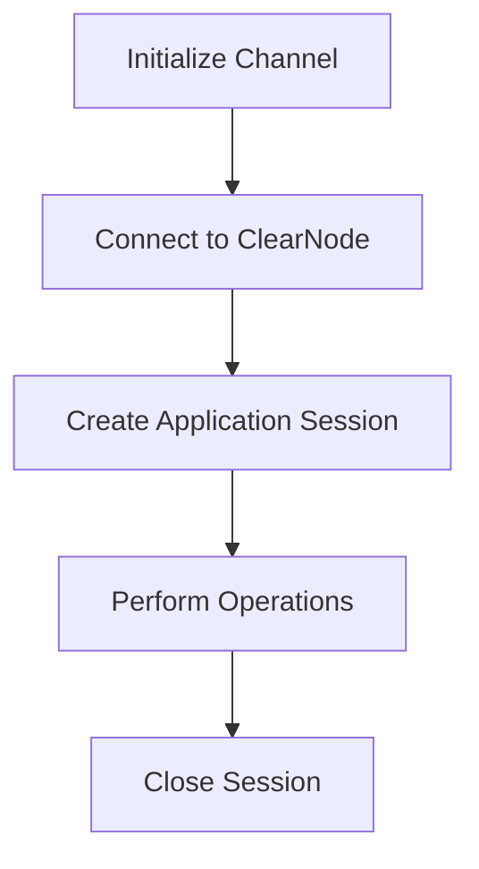

# Nitrolite SDK

[](https://www.npmjs.com/package/@erc7824/nitrolite)
[](https://github.com/erc7824/nitrolite/blob/main/LICENSE)
[](https://erc7824.org/quick_start)

A TypeScript SDK for building scalable blockchain applications using ERC-7824. The SDK provides a simple client interface that allows developers to create and manage channels with custom application logic.

## 📚 Documentation

- [Complete Documentation](https://erc7824.org/quick_start) - Full Documentation

## Features

- **Instant Finality**: Transactions settle immediately between parties
- **Reduced Gas Costs**: Most interactions happen off-chain, with minimal on-chain footprint
- **High Throughput**: Support for thousands of transactions per second
- **Security Guarantees**: Same security as on-chain, with cryptographic proofs
- **Framework Agnostic**: Works with any JavaScript framework (Vue, Angular, React, etc.)

## Installation

```bash
npm install @erc7824/nitrolite
```

## Quick Start

**[Nitrolite](https://www.npmjs.com/package/@erc7824/nitrolite)** is our official SDK for creating high-performance decentralized applications. It provides a comprehensive set of functions and types to establish WebSocket connections with ClearNode and manage application sessions.

## Prerequisites

Before you begin working with Nitrolite, ensure that you have:

- **Node.js**: Version 16 or later
- **Package Manager**: npm, yarn, or pnpm
- **Development Environment**:
    - For frontend: React, Vue, or similar framework
    - For backend: Node.js environment
- **Channel Setup**: Create a channel from your account at [apps.yellow.com](https://apps.yellow.com)

## ClearNode WebSocket

**ClearNode WebSocket URL**: `wss://clearnet.yellow.com/ws`

## Build with AI

We have generated a [llms-full.txt](https://erc7824.org/llms-full.txt) file that converts all our documentation into a single markdown document following the https://llmstxt.org/ standard.

## Complete Workflow



## Next steps

Building applications with Nitrolite involves these key steps:

1. **[Channel Creation](https://erc7824.org/quick_start/initializing_channel)**: Create a channel from your account at apps.yellow.com
2. **[ClearNode Connection](https://erc7824.org/quick_start/connect_to_the_clearnode)**: Establish WebSocket connection for off-chain messaging
3. **[Application Sessions](https://erc7824.org/quick_start/application_session)**: Create sessions to run specific applications
4. **[Session Closure](https://erc7824.org/quick_start/close_session)**: Properly close application sessions when finished

We recommend working through these guides in sequence to understand the complete application workflow. Each guide builds on concepts from previous sections.

Start with the [Channel Creation](https://erc7824.org/quick_start/initializing_channel) guide to begin your journey with Nitrolite applications.

## Documentation

For complete documentation, visit [https://erc7824.org](https://erc7824.org)

## Contributing

Contributions are welcome! Please feel free to submit a Pull Request.

## License

This project is licensed under the MIT License - see the LICENSE file for details.
