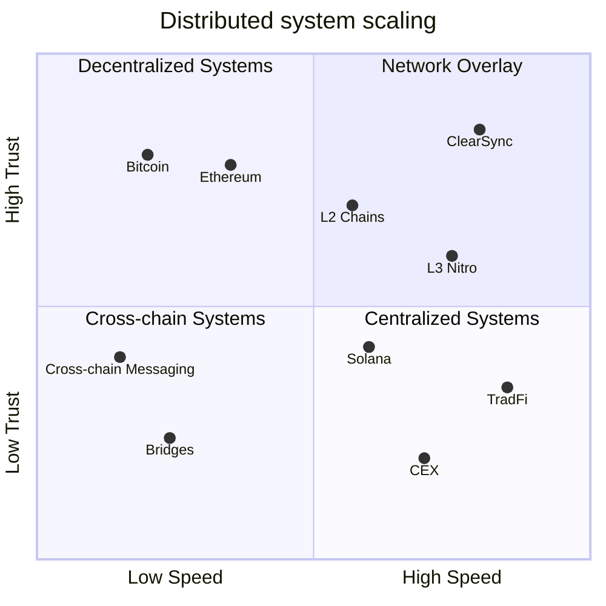

# Inject Nitro in your Stack

Blockchain technology has introduced a paradigm shift in how digital assets and decentralized applications (dApps) operate. However, scalability, transaction costs, and cross-chain interoperability remain significant challenges. **ERC-7824** and the **Nitro Protocol** provide a solution by enabling **off-chain state channels**, allowing seamless and efficient transactions without compromising on security or performance.

ERC-7824 defines a minimal, universal interface for state channel interactions without assuming any specific underlying chain, making it naturally chain agnostic. It abstracts away chain-specific details by specifying data structures and messaging formats that can be verified on any blockchain with basic smart contract capabilities. As a result, developers can rely on ERC-7824’s standard approach for off-chain interactions and dispute resolution across multiple L1 or L2 networks, preserving interoperability and reusability of state channel components in a wide range of environments.

## Supercharging Web2/3 Applications

The Nitro Protocol is designed to integrate effortlessly with **both Web2 and Web3 applications**. Whether operating in traditional infrastructure or leveraging blockchain ecosystems, developers can **enhance their software stack** with blockchain-grade security and efficiency without sacrificing speed or requiring major architectural changes.

## Key Benefits of ERC-7824 and Nitro Protocol

1. **Scalability Without Congestion**  
   By moving most interactions off-chain and leveraging **state channels**, Nitro enables **near-instant, gas-free transactions**, reducing load on the base layer blockchain.

2. **Cost Efficiency**  
   Users and applications **avoid high gas fees** by settling transactions off-chain while maintaining an on-chain fallback for dispute resolution.

3. **Chain Agnosticism & Interoperability**  
   ERC-7824 is designed to be **cross-chain compatible**, allowing seamless **interactions between different blockchain ecosystems**. This enables **cross-chain asset transfers, atomic swaps, and multi-chain smart contract execution**.

4. **Security & Trustless Execution**  
   - Transactions occur off-chain but remain **cryptographically signed and enforceable** on-chain.
   - **ForceMove** dispute resolution mechanism ensures that **malicious actors cannot manipulate state transitions**.

5. **Modular & Flexible**  
   The protocol provides **plug-and-play interfaces**, allowing developers to build **custom business logic** while ensuring compatibility with the ERC-7824 framework.

6. **Real-World Applications**  
   - **DeFi Scaling:** Enables off-chain transactions and batch settlements for **DEXs and lending protocols**.  
   - **Gaming & Metaverse:** Supports **high-speed microtransactions** for in-game economies.  
   - **Cross-Chain Payments:** Facilitates **low-cost, instant remittances and global transactions**.  
   - **Enterprise & Supply Chain:** Enhances **multi-party agreements and digital asset settlement**.

## Summary

ERC-7824 and the Nitro Protocol provide the **next-generation infrastructure** for decentralized applications, bridging the gap between **legacy systems and blockchain**. By combining **off-chain speed** with **on-chain security**, this framework allows developers to build high-performance, scalable solutions without being tied to a single blockchain network.
