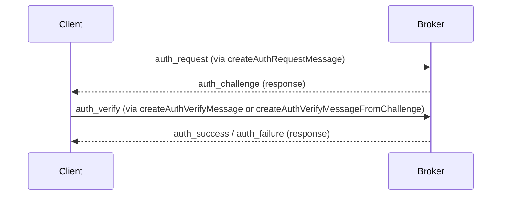

import MethodDetails from '@site/src/components/MethodDetails';

# RPC Message Creation API

The functions detailed below are part of the `@erc7824/nitrolite` SDK and provide a convenient way to create fully formed, signed, and stringified JSON RPC request messages. These messages are ready for transmission over a WebSocket or any other transport layer communicating with a Nitrolite-compatible broker.

Each function typically takes a `MessageSigner` (a function you provide to sign messages, usually integrating with a user's wallet) and other relevant parameters, then returns a `Promise<string>` which resolves to the JSON string of the signed RPC message.

## Authentication

These functions are used for the client authentication flow with the broker. The typical sequence is:
1. Client sends an `auth_request` (using `createAuthRequestMessage`).
2. Broker responds with an `auth_challenge`.
3. Client signs the challenge and sends an `auth_verify` (using `createAuthVerifyMessageFromChallenge` or `createAuthVerifyMessage`).
4. Broker responds with `auth_success` or `auth_failure`.



<MethodDetails
  name="createAuthRequestMessage"
  description="Creates the signed, stringified message body for an 'auth_request'. This request initiates the authentication process with the broker."
  params={[
    { name: "signer", type: "MessageSigner", description: "The function to sign the request payload." },
    { name: "clientAddress", type: "Address", description: "The Ethereum address of the client authenticating." },
    { name: "requestId", type: "RequestID", description: "Optional request ID. Defaults to a generated ID.", optional: true },
    { name: "timestamp", type: "Timestamp", description: "Optional timestamp. Defaults to the current time.", optional: true }
  ]}
  returns="Promise<string>"
  example={`
import { createAuthRequestMessage } from "@erc7824/nitrolite";
// Assuming 'signer' and 'clientAddress' are defined
const authRequestMsg = await createAuthRequestMessage(signer, clientAddress);
// Send authRequestMsg via WebSocket
`}
/>

<MethodDetails
  name="createAuthVerifyMessageFromChallenge"
  description="Creates the signed, stringified message body for an 'auth_verify' request using an explicitly provided challenge string. Use this if you have already parsed the 'auth_challenge' response yourself and extracted the challenge."
  params={[
    { name: "signer", type: "MessageSigner", description: "The function to sign the 'auth_verify' request payload." },
    { name: "clientAddress", type: "Address", description: "The Ethereum address of the client authenticating." },
    { name: "challenge", type: "string", description: "The challenge string extracted from the 'auth_challenge' response." },
    { name: "requestId", type: "RequestID", description: "Optional request ID for the 'auth_verify' request. Defaults to a generated ID.", optional: true },
    { name: "timestamp", type: "Timestamp", description: "Optional timestamp for the 'auth_verify' request. Defaults to the current time.", optional: true }
  ]}
  returns="Promise<string>"
  example={`
import { createAuthVerifyMessageFromChallenge } from "@erc7824/nitrolite";
// Assuming 'signer', 'clientAddress', and 'challengeString' are defined
const authVerifyMsg = await createAuthVerifyMessageFromChallenge(signer, clientAddress, challengeString);
// Send authVerifyMsg via WebSocket
`}
/>

<MethodDetails
  name="createAuthVerifyMessage"
  description="Creates the signed, stringified message body for an 'auth_verify' request by parsing the challenge from the raw 'auth_challenge' response received from the broker. This is a convenience function that handles parsing the challenge for you."
  params={[
    { name: "signer", type: "MessageSigner", description: "The function to sign the 'auth_verify' request payload." },
    { name: "rawChallengeResponse", type: "string | object", description: "The raw JSON string or object received from the broker containing the 'auth_challenge'." },
    { name: "clientAddress", type: "Address", description: "The Ethereum address of the client authenticating (must match the address used in 'auth_request')." },
    { name: "requestId", type: "RequestID", description: "Optional request ID for the 'auth_verify' request. Defaults to a generated ID.", optional: true },
    { name: "timestamp", type: "Timestamp", description: "Optional timestamp for the 'auth_verify' request. Defaults to the current time.", optional: true }
  ]}
  returns="Promise<string>"
  example={`
import { createAuthVerifyMessage } from "@erc7824/nitrolite";
// Assuming 'signer', 'rawChallengeResponseData', and 'clientAddress' are defined
const authVerifyMsg = await createAuthVerifyMessage(signer, rawChallengeResponseData, clientAddress);
// Send authVerifyMsg via WebSocket
`}
/>

## General & Keep-Alive

Functions for general RPC interactions like keep-alive messages.

<MethodDetails
  name="createPingMessage"
  description="Creates the signed, stringified message body for a 'ping' request. Useful for keeping a WebSocket connection alive."
  params={[
    { name: "signer", type: "MessageSigner", description: "The function to sign the request payload." },
    { name: "requestId", type: "RequestID", description: "Optional request ID. Defaults to a generated ID.", optional: true },
    { name: "timestamp", type: "Timestamp", description: "Optional timestamp. Defaults to the current time.", optional: true }
  ]}
  returns="Promise<string>"
  example={`
import { createPingMessage } from "@erc7824/nitrolite";
// Assuming 'signer' is defined
const pingMsg = await createPingMessage(signer);
// Send pingMsg via WebSocket
`}
/>

## Query Operations

Functions for retrieving information from the broker.

<MethodDetails
  name="createGetConfigMessage"
  description="Creates the signed, stringified message body for a 'get_config' request to retrieve broker configuration."
  params={[
    { name: "signer", type: "MessageSigner", description: "The function to sign the request payload." },
    { name: "requestId", type: "RequestID", description: "Optional request ID. Defaults to a generated ID.", optional: true },
    { name: "timestamp", type: "Timestamp", description: "Optional timestamp. Defaults to the current time.", optional: true }
  ]}
  returns="Promise<string>"
  example={`
import { createGetConfigMessage } from "@erc7824/nitrolite";
// Assuming 'signer' is defined
const getConfigMsg = await createGetConfigMessage(signer);
// Send getConfigMsg via WebSocket
`}
/>

<MethodDetails
  name="createGetLedgerBalancesMessage"
  description="Creates the signed, stringified message body for a 'get_ledger_balances' request to fetch balances for a specific participant."
  params={[
    { name: "signer", type: "MessageSigner", description: "The function to sign the request payload." },
    { name: "participant", type: "Address", description: "The participant address to get ledger balances for." },
    { name: "requestId", type: "RequestID", description: "Optional request ID. Defaults to a generated ID.", optional: true },
    { name: "timestamp", type: "Timestamp", description: "Optional timestamp. Defaults to the current time.", optional: true }
  ]}
  returns="Promise<string>"
  example={`
import { createGetLedgerBalancesMessage } from "@erc7824/nitrolite";
// Assuming 'signer' and 'participant' are defined
const getBalancesMsg = await createGetLedgerBalancesMessage(signer, participant);
// Send getBalancesMsg via WebSocket
`}
/>

<MethodDetails
  name="createGetAppDefinitionMessage"
  description="Creates the signed, stringified message body for a 'get_app_definition' request to retrieve the definition of a specific application."
  params={[
    { name: "signer", type: "MessageSigner", description: "The function to sign the request payload." },
    { name: "appSessionId", type: "AccountID", description: "The Application Session ID to get the definition for." },
    { name: "requestId", type: "RequestID", description: "Optional request ID. Defaults to a generated ID.", optional: true },
    { name: "timestamp", type: "Timestamp", description: "Optional timestamp. Defaults to the current time.", optional: true }
  ]}
  returns="Promise<string>"
  example={`
import { createGetAppDefinitionMessage } from "@erc7824/nitrolite";
// Assuming 'signer' and 'appSessionId' are defined
const getAppDefMsg = await createGetAppDefinitionMessage(signer, appSessionId);
// Send getAppDefMsg via WebSocket
`}
/>

<MethodDetails
  name="createGetChannelsMessage"
  description="Creates the signed, stringified message body for a 'get_channels' request to retrieve channels for a specific participant."
  params={[
    { name: "signer", type: "MessageSigner", description: "The function to sign the request payload." },
    { name: "participant", type: "Address", description: "The participant address to get channels for." },
    { name: "requestId", type: "RequestID", description: "Optional request ID. Defaults to a generated ID.", optional: true },
    { name: "timestamp", type: "Timestamp", description: "Optional timestamp. Defaults to the current time.", optional: true }
  ]}
  returns="Promise<string>"
  example={`
import { createGetChannelsMessage } from "@erc7824/nitrolite";
// Assuming 'signer' and 'participant' are defined
const getChannelsMsg = await createGetChannelsMessage(signer, participant);
// Send getChannelsMsg via WebSocket
`}
/>

## Application Session Management

Functions for creating and closing application sessions (state channels).

<MethodDetails
  name="createAppSessionMessage"
  description="Creates the signed, stringified message body for a 'create_app_session' request. This is used to propose the creation of a new state channel (application session)."
  params={[
    { name: "signer", type: "MessageSigner", description: "The function to sign the request payload." },
    { name: "params", type: "CreateAppSessionRequest[]", description: "An array of parameters defining the application session(s) to be created. See RPC Type Definitions for `CreateAppSessionRequest` structure." },
    { name: "requestId", type: "RequestID", description: "Optional request ID. Defaults to a generated ID.", optional: true },
    { name: "timestamp", type: "Timestamp", description: "Optional timestamp. Defaults to the current time.", optional: true }
  ]}
  returns="Promise<string>"
  example={`
import { createAppSessionMessage } from "@erc7824/nitrolite";
// Assuming 'signer' and 'appSessionParams' are defined
const createAppMsg = await createAppSessionMessage(signer, appSessionParams);
// Send createAppMsg via WebSocket
`}
/>

<MethodDetails
  name="createCloseAppSessionMessage"
  description="Creates the signed, stringified message body for a 'close_app_session' request. This is used to propose the closure of an existing state channel (application session) with final allocations. Note: This function only adds the caller's signature; multi-signature coordination happens externally if required by the application definition."
  params={[
    { name: "signer", type: "MessageSigner", description: "The function to sign the request payload." },
    { name: "params", type: "CloseAppSessionRequest[]", description: "An array of parameters defining the application session(s) to be closed, including final allocations. See RPC Type Definitions for `CloseAppSessionRequest` structure." },
    { name: "requestId", type: "RequestID", description: "Optional request ID. Defaults to a generated ID.", optional: true },
    { name: "timestamp", type: "Timestamp", description: "Optional timestamp. Defaults to the current time.", optional: true }
  ]}
  returns="Promise<string>"
  example={`
import { createCloseAppSessionMessage } from "@erc7824/nitrolite";
// Assuming 'signer' and 'closeParams' are defined
const closeAppMsg = await createCloseAppSessionMessage(signer, closeParams);
// Send closeAppMsg via WebSocket
`}
/>

## Application-Specific Messaging

Function for sending messages within an active application session.

<MethodDetails
  name="createApplicationMessage"
  description="Creates the signed, stringified message body for sending a generic 'message' within an active application session (state channel). This is used for off-chain state updates and other application-specific communication."
  params={[
    { name: "signer", type: "MessageSigner", description: "The function to sign the request payload." },
    { name: "appSessionId", type: "Hex", description: "The Application Session ID the message is scoped to." },
    { name: "messageParams", type: "any[]", description: "The actual message content/parameters being sent, specific to the application logic." },
    { name: "requestId", type: "RequestID", description: "Optional request ID. Defaults to a generated ID.", optional: true },
    { name: "timestamp", type: "Timestamp", description: "Optional timestamp. Defaults to the current time.", optional: true }
  ]}
  returns="Promise<string>"
  example={`
import { createApplicationMessage } from "@erc7824/nitrolite";
// Assuming 'signer', 'appSessionId', and 'appSpecificMessageData' are defined
const appMsg = await createApplicationMessage(signer, appSessionId, [appSpecificMessageData]);
// Send appMsg via WebSocket
`}
/>

## Ledger Channel Management

Functions for managing the underlying ledger channels (direct channels with the broker).

<MethodDetails
  name="createCloseChannelMessage"
  description="Creates the signed, stringified message body for a 'close_channel' request. This is used to close a direct ledger channel with the broker."
  params={[
    { name: "signer", type: "MessageSigner", description: "The function to sign the request payload." },
    { name: "channelId", type: "AccountID", description: "The Channel ID of the direct ledger channel to close." },
    { name: "fundDestination", type: "Address", description: "The Ethereum address where funds from this channel should be sent upon closure." },
    { name: "requestId", type: "RequestID", description: "Optional request ID. Defaults to a generated ID.", optional: true },
    { name: "timestamp", type: "Timestamp", description: "Optional timestamp. Defaults to the current time.", optional: true }
  ]}
  returns="Promise<string>"
  example={`
import { createCloseChannelMessage } from "@erc7824/nitrolite";
// Assuming 'signer', 'channelId', and 'fundDestination' are defined
const closeChannelMsg = await createCloseChannelMessage(signer, channelId, fundDestination);
// Send closeChannelMsg via WebSocket
`}
/>

<MethodDetails
  name="createResizeChannelMessage"
  description="Creates the signed, stringified message body for a 'resize_channel' request. This is used to add or remove funds from a direct ledger channel with the broker."
  params={[
    { name: "signer", type: "MessageSigner", description: "The function to sign the request payload." },
    { name: "params", type: "ResizeChannel[]", description: "An array of parameters defining the resize operation. See RPC Type Definitions for `ResizeChannel` structure." },
    { name: "requestId", type: "RequestID", description: "Optional request ID. Defaults to a generated ID.", optional: true },
    { name: "timestamp", type: "Timestamp", description: "Optional timestamp. Defaults to the current time.", optional: true }
  ]}
  returns="Promise<string>"
  example={`
import { createResizeChannelMessage } from "@erc7824/nitrolite";
// Assuming 'signer' and 'resizeParams' are defined
const resizeMsg = await createResizeChannelMessage(signer, resizeParams);
// Send resizeMsg via WebSocket
`}
/>

## Advanced: Creating a Local Signer for Development

To begin, you'll often need a fresh key pair (private key, public key, and address). The `generateKeyPair` utility can be used for this:

```typescript
import { ethers } from "ethers"; // Make sure ethers is installed

// Definition (as provided in your example)
interface CryptoKeypair {
    privateKey: string;
    publicKey: string;
    address: string;
}

export const generateKeyPair = async (): Promise<CryptoKeypair> => {
    try {
        const wallet = ethers.Wallet.createRandom();
        const privateKeyHash = ethers.utils.keccak256(wallet.privateKey);
        const walletFromHashedKey = new ethers.Wallet(privateKeyHash);

        return {
            privateKey: privateKeyHash,
            publicKey: walletFromHashedKey.publicKey,
            address: walletFromHashedKey.address,
        };
    } catch (error) {
        console.error('Error generating keypair, using fallback:', error);
        const randomHex = ethers.utils.randomBytes(32);
        const privateKey = ethers.utils.keccak256(randomHex);
        const wallet = new ethers.Wallet(privateKey);

        return {
            privateKey: privateKey,
            publicKey: wallet.publicKey,
            address: wallet.address,
        };
    }
};

// Usage:
async function main() {
  const keyPair = await generateKeyPair();
  console.log("Generated Private Key:", keyPair.privateKey);
  console.log("Generated Address:", keyPair.address);
  // Store keyPair.privateKey securely if you need to reuse this signer
}
```
This function creates a new random wallet, hashes its private key for deriving a new one (a common pattern for deterministic key generation or added obfuscation, though the security implications depend on the exact use case), and returns the private key, public key, and address.

### Creating a Signer from a Private Key

Once you have a private key (either generated as above or from a known development account), you can create a `MessageSigner` compatible with the RPC message creation functions. The `MessageSigner` interface typically expects an asynchronous `sign` method.

```typescript
import { ethers } from "ethers";
import { Hex } from "viem"; // Assuming Hex type is from viem or similar

// Definitions (as provided in your example)
type RequestData = unknown; // Placeholder for actual request data type
type ResponsePayload = unknown; // Placeholder for actual response payload type

interface WalletSigner {
    publicKey: string;
    address: Hex;
    sign: (payload: RequestData | ResponsePayload) => Promise<Hex>;
}

export const createEthersSigner = (privateKey: string): WalletSigner => {
    try {
        const wallet = new ethers.Wallet(privateKey);

        return {
            publicKey: wallet.publicKey,
            address: wallet.address as Hex,
            sign: async (payload: RequestData | ResponsePayload): Promise<Hex> => {
                try {
                    // The NitroliteRPC.hashMessage method should ideally be used here
                    // to ensure the exact same hashing logic as the SDK internals.
                    // For demonstration, using a generic hashing approach:
                    const messageToSign = JSON.stringify(payload);
                    const messageHash = ethers.utils.id(messageToSign); // ethers.utils.id performs keccak256
                    const messageBytes = ethers.utils.arrayify(messageHash);

                    const flatSignature = await wallet._signingKey().signDigest(messageBytes);
                    const signature = ethers.utils.joinSignature(flatSignature);
                    return signature as Hex;
                } catch (error) {
                    console.error('Error signing message:', error);
                    throw error;
                }
            },
        };
    } catch (error) {
        console.error('Error creating ethers signer:', error);
        throw error;
    }
};

// Usage:
async function setupSigner() {
  const keyPair = await generateKeyPair(); // Or use a known private key
  const localSigner = createEthersSigner(keyPair.privateKey);

  // Now 'localSigner' can be passed to the RPC message creation functions:
  // const authRequest = await createAuthRequestMessage(localSigner.sign, localSigner.address as Address);
  // console.log("Auth Request with local signer:", authRequest);
}
```

**Important Considerations for `createEthersSigner`:**
*   **Hashing Consistency:** The `sign` method within `createEthersSigner` must hash the payload in a way that is **identical** to how the `NitroliteRPC` class (specifically `NitroliteRPC.hashMessage`) expects messages to be hashed before signing. The example above uses `ethers.utils.id(JSON.stringify(payload))`. It's crucial to verify if the SDK's internal hashing uses a specific message prefix (e.g., EIP-191 personal_sign prefix) or a different serialization method. If the SDK does *not* use a standard EIP-191 prefix, or uses a custom one, your local signer's hashing logic must replicate this exactly for signatures to be valid. Using `NitroliteRPC.hashMessage(payload)` directly (if `payload` matches the `NitroliteRPCMessage` structure) is the safest way to ensure consistency.
*   **Type Compatibility:** Ensure the `Address` type expected by functions like `createAuthRequestMessage` is compatible with `localSigner.address`. The example uses `localSigner.address as Address` assuming `Address` is `0x${string}`.
*   **Error Handling:** The provided examples include basic error logging. Robust applications should implement more sophisticated error handling.
