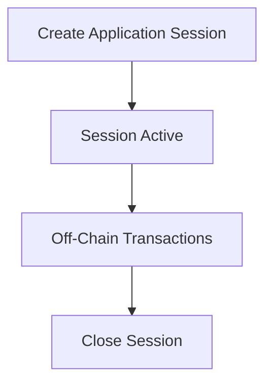

import Tabs from '@theme/Tabs';
import TabItem from '@theme/TabItem';

# Create Application Sessions

After connecting to a ClearNode and checking your channel balances, you can create application sessions to interact with specific applications on the state channel network. Application sessions allow you to perform off-chain transactions and define custom behavior for your interactions.

## Understanding Application Sessions



Application sessions in Nitrolite allow you to:

- Create isolated environments for specific interactions
- Define rules for off-chain transactions
- Specify how funds are allocated between participants
- Implement custom application logic and state management

An application session serves as a mechanism to track and manage interactions between participants, with the ClearNode acting as a facilitator.

## Creating an Application Session

To create an application session, you'll use the `createAppSessionMessage` helper from NitroliteRPC. Here's how to do it:

<Tabs>
  <TabItem value="react" label="React">

```javascript
import { createAppSessionMessage, parseRPCResponse, MessageSigner, CreateAppSessionRPCParams } from '@erc7824/nitrolite';
import { useCallback } from 'react';
import { Address } from 'viem';

function useCreateApplicationSession() {
  const createApplicationSession = useCallback(
    async (
      signer: MessageSigner,
      sendRequest: (message: string) => Promise<CreateAppSessionRPCParams>,
      participantA: Address,
      participantB: Address,
      amount: string,
    ) => {
      try {
        // Define the application parameters
        const appDefinition = {
          protocol: 'nitroliterpc',
          participants: [participantA, participantB],
          weights: [100, 0],  // Weight distribution for consensus
          quorum: 100,        // Required consensus percentage
          challenge: 0,       // Challenge period
          nonce: Date.now(),  // Unique identifier
        };

        // Define allocations with asset type instead of token address
        const allocations = [
          {
            participant: participantA,
            asset: 'usdc',
            amount: amount,
          },
          {
            participant: participantB,
            asset: 'usdc',
            amount: '0',
          },
        ];

        // Create a signed message using the createAppSessionMessage helper
        const signedMessage = await createAppSessionMessage(
          signer,
          [
            {
              definition: appDefinition,
              allocations: allocations,
            },
          ]
        );

        // Send the signed message to the ClearNode
        const response = await sendRequest(signedMessage);

        // Handle the response
        if (response.app_session_id) {
          // Store the app session ID for future reference
          localStorage.setItem('app_session_id', response.app_session_id);
          return { success: true, app_session_id: response.app_session_id, response };
        } else {
          return { success: true, response };
        }
      } catch (error) {
        console.error('Error creating application session:', error);
        return {
          success: false,
          error: error instanceof Error
            ? error.message
            : 'Unknown error during session creation',
        };
      }
    },
    []
  );

  return { createApplicationSession };
}

// Usage example
function MyComponent() {
  const { createApplicationSession } = useCreateApplicationSession();
  
  const handleCreateSession = async () => {
    // Define your WebSocket send wrapper
    const sendRequest = async (payload: string) => {
      return new Promise((resolve, reject) => {
        // Assuming ws is your WebSocket connection
        const handleMessage = (event) => {
          try {
            const message = parseRPCResponse(event.data);
            if (message.method === RPCMethod.CreateAppSession) {
              ws.removeEventListener('message', handleMessage);
              resolve(message.params);
            }
          } catch (error) {
            console.error('Error parsing message:', error);
          }
        };
        
        ws.addEventListener('message', handleMessage);
        ws.send(payload);
        
        // Set timeout to prevent hanging
        setTimeout(() => {
          ws.removeEventListener('message', handleMessage);
          reject(new Error('App session creation timeout'));
        }, 10000);
      });
    };
    
    const result = await createApplicationSession(
      walletSigner,      // Your signer object
      sendRequest,       // Function to send the request
      '0xYourAddress',   // Your address
      '0xOtherAddress',  // Other participant's address
      '100',             // Amount
    );
    
    if (result.success) {
      console.log(`Application session created with ID: ${result.app_session_id}`);
    } else {
      console.error(`Failed to create application session: ${result.error}`);
    }
  };
  
  return (
    <button onClick={handleCreateSession}>Create Application Session</button>
  );
}
```

  </TabItem>
  <TabItem value="angular" label="Angular">

```typescript
// app-session.service.ts
import { Injectable } from '@angular/core';
import { createAppSessionMessage } from '@erc7824/nitrolite';
import { ethers } from 'ethers';
import { BehaviorSubject, Observable, from } from 'rxjs';
import { tap, catchError } from 'rxjs/operators';

@Injectable({
  providedIn: 'root'
})
export class AppSessionService {
  private webSocket: WebSocket | null = null;
  private appIdSubject = new BehaviorSubject<string | null>(null);
  
  public appId$ = this.appIdSubject.asObservable();
  
  constructor() {
    // Retrieve app ID from storage if available
    const storedAppId = localStorage.getItem('app_session_id');
    if (storedAppId) {
      this.appIdSubject.next(storedAppId);
    }
  }
  
  public setWebSocket(ws: WebSocket): void {
    this.webSocket = ws;
  }
  
  public createApplicationSession(
    signer: any,
    participantA: string,
    participantB: string,
    amount: string,
  ): Observable<any> {
    if (!this.webSocket) {
      throw new Error('WebSocket connection is not established');
    }
    
    return from(this.createAppSessionAsync(
      signer,
      participantA,
      participantB,
      amount,
    )).pipe(
      tap(result => {
        if (result.success && result.app_session_id) {
          localStorage.setItem('app_session_id', result.app_session_id);
          this.appIdSubject.next(result.app_session_id);
        }
      }),
      catchError(error => {
        console.error('Error creating application session:', error);
        throw error;
      })
    );
  }
  
  private async createAppSessionAsync(
    signer: any,
    participantA: string,
    participantB: string,
    amount: string,
  ): Promise<any> {
    try {
      
      // Define the application parameters
      const appDefinition = {
        protocol: 'nitroliterpc',
        participants: [participantA, participantB],
        weights: [100, 0],
        quorum: 100,
        challenge: 0,
        nonce: Date.now(),
      };
      
      // Define the allocations with asset type
      const allocations = [
        {
          participant: participantA,
          asset: 'usdc',
          amount: amount,
        },
        {
          participant: participantB,
          asset: 'usdc',
          amount: '0',
        },
      ];
      
      // Create message signer function
      const messageSigner = async (payload: any) => {
        const message = JSON.stringify(payload);
        const digestHex = ethers.id(message);
        const messageBytes = ethers.getBytes(digestHex);
        const signature = await signer.signMessage(messageBytes);
        return signature;
      };
      
      // Create the signed message
      const signedMessage = await createAppSessionMessage(
        messageSigner,
        [
          {
            definition: appDefinition,
            allocations: allocations,
          },
        ]
      );
      
      // Send the message and wait for response
      return await this.sendRequest(signedMessage);
    } catch (error) {
      console.error('Error in createAppSessionAsync:', error);
      return {
        success: false,
        error: error instanceof Error ? error.message : 'Unknown error'
      };
    }
  }
  
  private sendRequest(payload: string): Promise<any> {
    return new Promise((resolve, reject) => {
      if (!this.webSocket) {
        reject(new Error('WebSocket not connected'));
        return;
      }
      
      const handleMessage = (event: MessageEvent) => {
        try {
          const message = JSON.parse(event.data);
          if (message.res && message.res[1] === 'create_app_session') {
            this.webSocket?.removeEventListener('message', handleMessage);
            resolve({
              success: true,
              app_session_id: message.res[2]?.[0]?.app_session_id || null,
              status: message.res[2]?.[0]?.status || "open",
              response: message.res[2]
            });
          }
          
          if (message.err) {
            this.webSocket?.removeEventListener('message', handleMessage);
            reject(new Error(`Error: ${message.err[1]} - ${message.err[2]}`));
          }
        } catch (error) {
          console.error('Error parsing message:', error);
        }
      };
      
      this.webSocket.addEventListener('message', handleMessage);
      this.webSocket.send(payload);
      
      // Set timeout to prevent hanging
      setTimeout(() => {
        this.webSocket?.removeEventListener('message', handleMessage);
        reject(new Error('App session creation timeout'));
      }, 10000);
    });
  }
}

// app-session.component.ts
import { Component, OnInit } from '@angular/core';
import { AppSessionService } from './app-session.service';

@Component({
  selector: 'app-session-creator',
  template: `
    <div class="app-session-container">
      <h3>Create Application Session</h3>
      <div *ngIf="appId">
        Current Application Session ID: {{ appId }}
      </div>
      <button (click)="createAppSession()" [disabled]="isCreating">
        {{ isCreating ? 'Creating...' : 'Create Application Session' }}
      </button>
      <div *ngIf="error" class="error-message">
        {{ error }}
      </div>
    </div>
  `,
  styles: [`
    .app-session-container {
      margin: 20px;
      padding: 15px;
      border: 1px solid #eee;
      border-radius: 5px;
    }
    .error-message {
      color: red;
      margin-top: 10px;
    }
  `]
})
export class AppSessionComponent implements OnInit {
  appId: string | null = null;
  isCreating = false;
  error: string | null = null;
  
  constructor(private appSessionService: AppSessionService) {}
  
  ngOnInit(): void {
    // Subscribe to app ID changes
    this.appSessionService.appId$.subscribe(id => {
      this.appId = id;
    });
    
    // Initialize WebSocket (implementation would depend on your setup)
    const ws = new WebSocket('wss://your-clearnode-endpoint');
    ws.onopen = () => {
      this.appSessionService.setWebSocket(ws);
    };
  }
  
  createAppSession(): void {
    this.isCreating = true;
    this.error = null;
    
    // Sample values - in a real app you'd get these from input fields or a service
    const participantA = '0xYourAddress';
    const participantB = '0xOtherAddress';
    const amount = '1000000'; // 1 USDC with 6 decimals
    
    // Assuming you have access to a signer (e.g., from MetaMask)
    const signer = window.ethereum && new ethers.providers.Web3Provider(window.ethereum).getSigner();
    
    if (!signer) {
      this.error = 'No wallet connected';
      this.isCreating = false;
      return;
    }
    
    this.appSessionService.createApplicationSession(
      signer,
      participantA,
      participantB,
      amount
    ).subscribe({
      next: (result) => {
        console.log('App session created:', result);
        this.isCreating = false;
      },
      error: (err) => {
        this.error = `Failed to create application session: ${err.message}`;
        this.isCreating = false;
      }
    });
  }
}
```

  </TabItem>
  <TabItem value="vue" label="Vue.js">

```javascript
<!-- AppSessionManager.vue -->
<template>
  <div class="app-session-manager">
    <h3>Application Session</h3>
    
    <div v-if="appId" class="current-session">
      <p>Current session ID: {{ appId }}</p>
    </div>
    
    <div class="create-session">
      <button 
        @click="createAppSession" 
        :disabled="isCreating || !isConnected"
      >
        {{ isCreating ? 'Creating...' : 'Create Application Session' }}
      </button>
      
      <div v-if="error" class="error-message">
        {{ error }}
      </div>
      
      <div v-if="!isConnected" class="warning-message">
        WebSocket not connected to ClearNode
      </div>
    </div>
  </div>
</template>

<script>
import { defineComponent, ref, onMounted, onUnmounted } from 'vue';
import { createAppSessionMessage } from '@erc7824/nitrolite';
import { ethers } from 'ethers';

export default defineComponent({
  name: 'AppSessionManager',
  
  setup() {
    const appId = ref(localStorage.getItem('app_session_id') || null);
    const isCreating = ref(false);
    const error = ref(null);
    const isConnected = ref(false);
    let webSocket = null;
    
    onMounted(() => {
      // Initialize WebSocket connection
      initWebSocket();
    });
    
    onUnmounted(() => {
      // Clean up WebSocket connection
      if (webSocket) {
        webSocket.close();
      }
    });
    
    const initWebSocket = () => {
      webSocket = new WebSocket('wss://your-clearnode-endpoint');
      
      webSocket.onopen = () => {
        isConnected.value = true;
        console.log('WebSocket connected to ClearNode');
      };
      
      webSocket.onclose = () => {
        isConnected.value = false;
        console.log('WebSocket disconnected from ClearNode');
      };
      
      webSocket.onerror = (e) => {
        isConnected.value = false;
        error.value = 'WebSocket connection error';
        console.error('WebSocket error:', e);
      };
    };
    
    const createAppSession = async () => {
      if (!isConnected.value || !webSocket) {
        error.value = 'WebSocket not connected';
        return;
      }
      
      try {
        isCreating.value = true;
        error.value = null;
        
        // Get Ethereum provider and signer
        if (!window.ethereum) {
          throw new Error('No Ethereum provider found');
        }
        
        const provider = new ethers.providers.Web3Provider(window.ethereum);
        const signer = provider.getSigner();
        const address = await signer.getAddress();
        
        // Use a sample counterparty address and token
        const participantA = address;
        const participantB = '0xOtherAddress';
        const amount = '1000000'; // 1 USDC with 6 decimals
            
        // Define app session parameters
        const appDefinition = {
          protocol: 'nitroliterpc',
          participants: [participantA, participantB],
          weights: [100, 0],
          quorum: 100,
          challenge: 0,
          nonce: Date.now(),
        };
        
        
        
        // Message signer function
        const messageSigner = async (payload) => {
          const message = JSON.stringify(payload);
          const digestHex = ethers.id(message);
          const messageBytes = ethers.getBytes(digestHex);
          return await signer.signMessage(messageBytes);
        };
        
        // Define allocations with asset type
        const allocations = [
          {
            participant: participantA,
            asset: 'usdc',
            amount: amount,
          },
          {
            participant: participantB,
            asset: 'usdc',
            amount: '0',
          },
        ];
        
        // Create signed message
        const signedMessage = await createAppSessionMessage(
          messageSigner,
          [
            {
              definition: appDefinition,
              allocations: allocations,
            },
          ]
        );
        
        // Send message and handle response
        const response = await sendWebSocketRequest(signedMessage);
        
        if (response.success && response.app_session_id) {
          appId.value = response.app_session_id;
          localStorage.setItem('app_session_id', response.app_session_id);
          console.log('Application session created successfully:', response.app_session_id);
        } else {
          console.warn('Session created but no app_session_id returned:', response);
        }
      } catch (err) {
        error.value = err.message || 'Error creating application session';
        console.error('Failed to create application session:', err);
      } finally {
        isCreating.value = false;
      }
    };
    
    const sendWebSocketRequest = (payload) => {
      return new Promise((resolve, reject) => {
        const handleMessage = (event) => {
          try {
            const message = JSON.parse(event.data);
            
            if (message.res && message.res[1] === 'create_app_session') {
              webSocket.removeEventListener('message', handleMessage);
              
              const appSessionId = message.res[2]?.[0]?.app_session_id;
              const status = message.res[2]?.[0]?.status || "open";
              resolve({
                success: true,
                app_session_id: appSessionId,
                status: status,
                response: message.res[2]
              });
            }
            
            if (message.err) {
              webSocket.removeEventListener('message', handleMessage);
              reject(new Error(`Error: ${message.err[1]} - ${message.err[2]}`));
            }
          } catch (error) {
            console.error('Error parsing message:', error);
          }
        };
        
        webSocket.addEventListener('message', handleMessage);
        webSocket.send(payload);
        
        // Set timeout to prevent hanging
        setTimeout(() => {
          webSocket.removeEventListener('message', handleMessage);
          reject(new Error('App session creation timeout'));
        }, 10000);
      });
    };
    
    return {
      appId,
      isCreating,
      error,
      isConnected,
      createAppSession
    };
  }
});
</script>

<style scoped>
.app-session-manager {
  padding: 20px;
  border: 1px solid #eee;
  border-radius: 8px;
  margin-bottom: 20px;
}
.current-session {
  margin-bottom: 15px;
  padding: 10px;
  background-color: #f5f5f5;
  border-radius: 4px;
}
.error-message {
  color: #d32f2f;
  margin-top: 10px;
}
.warning-message {
  color: #f57c00;
  margin-top: 10px;
}
button {
  padding: 8px 16px;
  background-color: #1976d2;
  color: white;
  border: none;
  border-radius: 4px;
  cursor: pointer;
}
button:disabled {
  background-color: #bbdefb;
  cursor: not-allowed;
}
</style>
```

  </TabItem>
  <TabItem value="nodejs" label="Node.js">

```javascript
import { createAppSessionMessage } from '@erc7824/nitrolite';
import WebSocket from 'ws';
import { ethers } from 'ethers';

/**
 * Create an app session
 * @param {string} participantA - First participant's address
 * @param {string} participantB - Second participant's address
 * @param {WebSocket} ws - WebSocket connection to the ClearNode
 * @param {object} wallet - Ethers wallet for signing
 * @returns {Promise<string>} The app session ID
 */
async function createAppSession(participantA, participantB, ws, wallet) {
  try {
    console.log(`Creating app session between ${participantA} and ${participantB}`);
    
    // Message signer function
    const messageSigner = async (payload) => {
      try {
        const message = JSON.stringify(payload);
        const digestHex = ethers.id(message);
        const messageBytes = ethers.getBytes(digestHex);
        const { serialized: signature } = wallet.signingKey.sign(messageBytes);
        return signature;
      } catch (error) {
        console.error("Error signing message:", error);
        throw error;
      }
    };
    
    // Create app definition
    const appDefinition = {
      protocol: "nitroliterpc",
      participants: [participantA, participantB],
      weights: [100, 0],
      quorum: 100,
      challenge: 0,
      nonce: Date.now(),
    };
    
    // Define the allocations with asset type (e.g., 1 USDC with 6 decimals)
    const amount = '1000000';
    
    // Define allocations
    const allocations = [
      {
        participant: participantA,
        asset: 'usdc',
        amount: amount,
      },
      {
        participant: participantB,
        asset: 'usdc',
        amount: '0',
      },
    ];
    
    // Create the signed message
    const signedMessage = await createAppSessionMessage(
      messageSigner,
      [
        {
          definition: appDefinition,
          allocations: allocations,
        },
      ]
    );
    
    // Send the message and wait for response
    return new Promise((resolve, reject) => {
      // Create a one-time message handler for the app session response
      const handleAppSessionResponse = (data) => {
        try {
          const rawData = typeof data === 'string' ? data : data.toString();
          const message = JSON.parse(rawData);
          
          console.log('Received app session creation response:', message);
          
          // Check if this is an app session response
          if (message.res && 
              (message.res[1] === 'create_app_session' || 
               message.res[1] === 'app_session_created')) {
            // Remove the listener once we get the response
            ws.removeListener('message', handleAppSessionResponse);
            
            // Extract app session ID from response
            const appSessionId = message.res[2]?.[0]?.app_session_id;
            if (!appSessionId) {
              reject(new Error('Failed to get app session ID from response'));
              return;
            }
            
            resolve(appSessionId);
          }
          
          // Check for error responses
          if (message.err) {
            ws.removeListener('message', handleAppSessionResponse);
            reject(new Error(`Error ${message.err[1]}: ${message.err[2]}`));
          }
        } catch (error) {
          console.error('Error handling app session response:', error);
        }
      };
      
      // Add the message handler
      ws.on('message', handleAppSessionResponse);
      
      // Set timeout to prevent hanging
      setTimeout(() => {
        ws.removeListener('message', handleAppSessionResponse);
        reject(new Error('App session creation timeout'));
      }, 10000);
      
      // Send the signed message
      ws.send(signedMessage);
    });
  } catch (error) {
    console.error('Error creating app session:', error);
    throw error;
  }
}

// Usage example
const participantA = '0x1234...';  // Your address
const participantB = '0x5678...';  // Other participant's address

// Assuming you have a WebSocket connection and wallet initialized
createAppSession(participantA, participantB, ws, wallet)
  .then(appSessionId => {
    console.log(`Application session created with ID: ${appSessionId}`);
    // Store the app session ID for future reference
  })
  .catch(error => {
    console.error('Failed to create application session:', error);
  });
```

  </TabItem>
  <TabItem value="server" label="Server with Multiple Players">

```javascript
/**
 * Nitrolite app sessions manager for game rooms
 */
import { createAppSessionMessage } from '@erc7824/nitrolite';
import { ethers } from 'ethers';

// Map to store app sessions by room ID
const roomAppSessions = new Map();

/**
 * Create an app session for a game room
 * @param {string} roomId - Room ID
 * @param {string} participantA - First player's address
 * @param {string} participantB - Second player's address
 * @param {WebSocket} ws - WebSocket connection to the ClearNode
 * @param {object} wallet - Ethers wallet for signing
 * @returns {Promise<string>} The app session ID
 */
export async function createAppSession(roomId, participantA, participantB, ws, wallet) {
  try {
    console.log(`Creating app session for room ${roomId}`);
    
    // Get the server's address
    const serverAddress = wallet.address;
    
    // Create app definition with server as a participant
    // In this setup, the server acts as a referee/facilitator
    const appDefinition = {
      protocol: "app_nitrolite_v0",
      participants: [participantA, participantB, serverAddress],
      weights: [0, 0, 100],  // Server has full control
      quorum: 100,
      challenge: 0,
      nonce: Date.now(),
    };
    
    // Define allocations with asset type
    const allocations = [
      {
        participant: participantA,
        asset: 'usdc',
        amount: '0',
      },
      {
        participant: participantB,
        asset: 'usdc',
        amount: '0',
      },
      {
        participant: serverAddress,
        asset: 'usdc',
        amount: '0',
      },
    ];
    
    // Message signer function
    const messageSigner = async (payload) => {
      try {
        const message = JSON.stringify(payload);
        const digestHex = ethers.id(message);
        const messageBytes = ethers.getBytes(digestHex);
        const { serialized: signature } = wallet.signingKey.sign(messageBytes);
        return signature;
      } catch (error) {
        console.error("Error signing message:", error);
        throw error;
      }
    };
    
    // Create the signed message
    const signedMessage = await createAppSessionMessage(
      messageSigner,
      [
        {
          definition: appDefinition,
          allocations: allocations,
        },
      ]
    );
    
    // Send the message and wait for response
    return new Promise((resolve, reject) => {
      // Create a one-time message handler for the app session response
      const handleAppSessionResponse = (data) => {
        try {
          const rawData = typeof data === 'string' ? data : data.toString();
          const message = JSON.parse(rawData);
          
          console.log('Received app session creation response:', message);
          
          // Check if this is an app session response
          if (message.res && 
              (message.res[1] === 'create_app_session' || 
               message.res[1] === 'app_session_created')) {
            // Remove the listener once we get the response
            ws.removeListener('message', handleAppSessionResponse);
            
            // Extract app session ID from response
            const appSessionId = message.res[2]?.[0]?.app_session_id;
            if (!appSessionId) {
              reject(new Error('Failed to get app session ID from response'));
              return;
            }
            
            // Get status from response
            const status = message.res[2]?.[0]?.status || "open";
            
            // Store the app session for this room
            roomAppSessions.set(roomId, {
              appSessionId,
              status,
              participantA,
              participantB,
              serverAddress,
              createdAt: Date.now()
            });
            
            resolve(appSessionId);
          }
          
          // Check for error responses
          if (message.err) {
            ws.removeListener('message', handleAppSessionResponse);
            reject(new Error(`Error ${message.err[1]}: ${message.err[2]}`));
          }
        } catch (error) {
          console.error('Error handling app session response:', error);
        }
      };
      
      // Add the message handler
      ws.on('message', handleAppSessionResponse);
      
      // Set timeout to prevent hanging
      setTimeout(() => {
        ws.removeListener('message', handleAppSessionResponse);
        reject(new Error('App session creation timeout'));
      }, 10000);
      
      // Send the signed message
      ws.send(signedMessage);
    });
  } catch (error) {
    console.error(`Error creating app session for room ${roomId}:`, error);
    throw error;
  }
}

/**
 * Get the app session for a room
 * @param {string} roomId - Room ID
 * @returns {Object|null} The app session or null if not found
 */
export function getAppSession(roomId) {
  return roomAppSessions.get(roomId) || null;
}

/**
 * Check if a room has an app session
 * @param {string} roomId - Room ID
 * @returns {boolean} Whether the room has an app session
 */
export function hasAppSession(roomId) {
  return roomAppSessions.has(roomId);
}
```

  </TabItem>
</Tabs>

## Key Components of an Application Session

When creating an application session, you need to define several key components:

| Component | Description | Example |
|-----------|-------------|---------|
| **Protocol** | Identifier for the application protocol | `"nitroliterpc"` |
| **Participants** | Array of participant addresses | `[userAddress, counterpartyAddress]` |
| **Weights** | Weight distribution for consensus | `[100, 0]` for user-controlled, `[50, 50]` for equal |
| **Quorum** | Required percentage for consensus | Usually `100` for full consensus |
| **Challenge** | Time period for disputing state | `0` for no challenge period |
| **Nonce** | Unique identifier | Typically `Date.now()` |
| **Allocations** | Array of allocation objects with: | `[{ participant: "0xAddress", asset: "usdc", amount: "100" }]` |
|            | - participant: Address of the participant | |
|            | - asset: Asset identifier (e.g., "usdc", "eth") | |
|            | - amount: String amount with precision | |

### Response Components

When a ClearNode responds to your application session creation request, it provides:

| Component | Description | Example |
|-----------|-------------|---------|
| **app_session_id** | Unique identifier for the application session | `"0x0ac588b2924edbbbe34bb4c51d089771bd7bd7018136c8c4317624112a8c9f79"` |
| **status** | Current state of the application session | `"open"` |

## Understanding the Response

When you create an application session, the ClearNode responds with information about the created session:

```javascript
// Example response
{
  "res": [
    2,                // Request ID
    "create_app_session", // Method name
    [
      {
        "app_session_id": "0x0ac588b2924edbbbe34bb4c51d089771bd7bd7018136c8c4317624112a8c9f79", // Session ID
        "status": "open"
      }
    ],
    1631234567890    // Timestamp
  ],
  "sig": ["0xSignature"]
}
```

The most important part of the response is the `app_session_id`, which you'll need for all future interactions with this application session.

## Application Session Use Cases

Application sessions can be used for various scenarios:

1. **Peer-to-peer payments**: Direct token transfers between users
2. **Gaming**: Turn-based games with state transitions
3. **Content access**: Pay-per-use access to digital content
4. **Service payments**: Metered payment for API or service usage
5. **Multi-party applications**: Applications involving more than two participants

## Best Practices

When working with application sessions, follow these best practices:

1. **Store the app_session_id securely**: You'll need it for all session-related operations
2. **Verify session creation**: Check for successful creation before proceeding
3. **Handle timeouts**: Implement proper timeout handling for session creation
4. **Clean up listeners**: Always remove message event listeners to prevent memory leaks
5. **Handle errors gracefully**: Provide clear error messages to users

## Next Steps

After creating an application session, you can:

1. Use the session for application-specific transactions
2. [Check your channel balances](balances) to monitor funds
3. [Close the application session](close_session) when you're done

For advanced use cases, see our detailed documentation on application workflows.