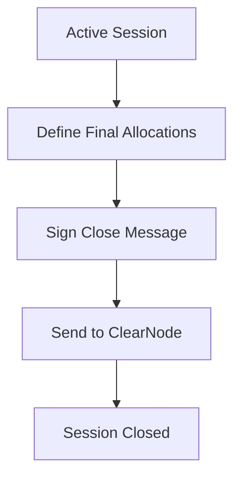
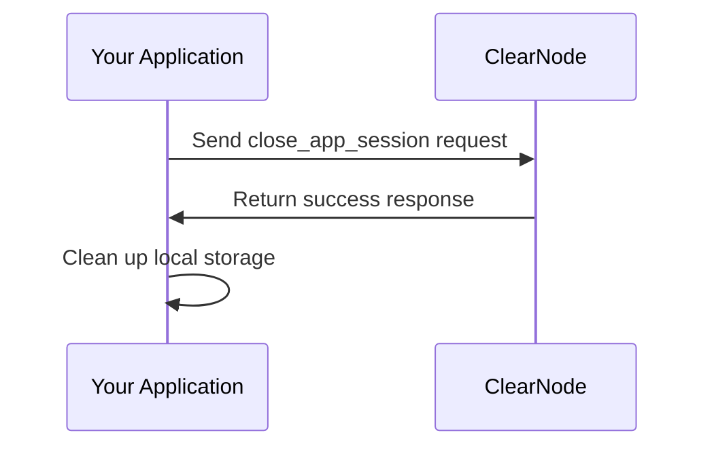

import Tabs from '@theme/Tabs';
import TabItem from '@theme/TabItem';

# Close Application Session

Once you've completed your interactions with an application session, it's important to properly close it. This finalizes the fund allocations and ensures that all participants agree on the final state.

## Why Properly Closing Sessions Matters

Closing an application session correctly is important because it:

- Finalizes fund allocations between participants
- Updates on-chain balances (if applicable)
- Frees up resources on the ClearNode
- Ensures the proper completion of all operations
- Prevents potential disputes



## Closing an Application Session

To close an application session, you'll use the `createCloseAppSessionMessage` helper from NitroliteRPC. Here's how to do it:

<Tabs>
  <TabItem value="react" label="React">

```javascript
import { useCallback } from 'react';
import { createCloseAppSessionMessage, parseRPCResponse, MessageSigner, CloseAppSessionRPCParams } from '@erc7824/nitrolite';

/**
 * Hook for closing an application session
 */
function useCloseApplicationSession() {
  const closeApplicationSession = useCallback(
    async (
      signer: MessageSigner,
      sendRequest: (message: string) => Promise<CloseAppSessionRPCParams>,
      appId: string,
      participantA: Address,
      participantB: Address,
      amount: string
    ) => {
      try {
        if (!appId) {
          throw new Error('Application ID is required to close the session.');
        }
        
        // Create allocations with asset type
        const allocations = [
          {
            participant: participantA,
            asset: 'usdc',
            amount: '0',
          },
          {
            participant: participantB,
            asset: 'usdc',
            amount: amount,
          },
        ];
        
        // Create the close request
        const closeRequest = {
          app_session_id: appId,
          allocations: allocations,
        };
        
        // Create the signed message
        const signedMessage = await createCloseAppSessionMessage(
          signer, 
          [closeRequest]
        );
        
        // Send the request and wait for response
        const response = await sendRequest(signedMessage);
        
        // Check for success
        if (response.app_session_id) {
          // Clean up local storage
          localStorage.removeItem('app_session_id');
          return { 
            success: true, 
            app_id: response.app_session_id,
            status: response.status || "closed", 
            response 
          };
        } else {
          return { success: true, response };
        }
      } catch (error) {
        console.error('Error closing application session:', error);
        return {
          success: false,
          error: error instanceof Error
            ? error.message
            : 'Unknown error during close session',
        };
      }
    },
    []
  );
  
  return { closeApplicationSession };
}

// Usage example
function MyComponent() {
  const { closeApplicationSession } = useCloseApplicationSession();
  
  const handleCloseSession = async () => {
    // Define your WebSocket send wrapper
    const sendRequest = async (payload) => {
      return new Promise((resolve, reject) => {
        // Assuming ws is your WebSocket connection
        const handleMessage = (event) => {
          try {
            const message = parseRPCResponse(event.data);
            if (message.method === RPCMethod.CloseAppSession) {
              ws.removeEventListener('message', handleMessage);
              resolve(message.params);
            }
          } catch (error) {
            console.error('Error parsing message:', error);
          }
        };
        
        ws.addEventListener('message', handleMessage);
        ws.send(payload);
        
        // Set timeout to prevent hanging
        setTimeout(() => {
          ws.removeEventListener('message', handleMessage);
          reject(new Error('Close app session timeout'));
        }, 10000);
      });
    };
    
    // Get the app session ID from where it was stored
    const appId = localStorage.getItem('app_session_id');
    
    // Define participant addresses
    const participantA = '0xYourAddress';
    const participantB = '0xOtherAddress';
    
    // Define amount
    const amount = '1000000'; // Amount to allocate to participantB
    
    const result = await closeApplicationSession(
      walletSigner,      // Your signer object
      sendRequest,       // Function to send the request
      appId,             // Application session ID
      participantA,      // First participant address
      participantB,      // Second participant address
      amount             // Amount to allocate to participant B
    );
    
    if (result.success) {
      console.log('Application session closed successfully');
    } else {
      console.error(`Failed to close application session: ${result.error}`);
    }
  };
  
  return (
    <button onClick={handleCloseSession}>Close Application Session</button>
  );
}
```

  </TabItem>
  <TabItem value="angular" label="Angular">

```typescript
// app-session.service.ts
import { Injectable } from '@angular/core';
import { createCloseAppSessionMessage } from '@erc7824/nitrolite';
import { ethers } from 'ethers';
import { BehaviorSubject, Observable, from } from 'rxjs';
import { tap, catchError } from 'rxjs/operators';

@Injectable({
  providedIn: 'root'
})
export class AppSessionService {
  private webSocket: WebSocket | null = null;
  private appIdSubject = new BehaviorSubject<string | null>(null);
  
  public appId$ = this.appIdSubject.asObservable();
  
  constructor() {
    // Retrieve app ID from storage if available
    const storedAppId = localStorage.getItem('app_session_id');
    if (storedAppId) {
      this.appIdSubject.next(storedAppId);
    }
  }
  
  public setWebSocket(ws: WebSocket): void {
    this.webSocket = ws;
  }
  
  // This method closes an application session
  public closeApplicationSession(
    signer: any,
    appId: string,
    finalAllocations: number[]
  ): Observable<any> {
    if (!this.webSocket) {
      throw new Error('WebSocket connection is not established');
    }
    
    if (!appId) {
      throw new Error('Application ID is required');
    }
    
    return from(this.closeAppSessionAsync(
      signer,
      appId,
      participantA,
      participantB,
      amount
    )).pipe(
      tap(result => {
        if (result.success) {
          // Remove app ID from storage
          localStorage.removeItem('app_session_id');
          this.appIdSubject.next(null);
        }
      }),
      catchError(error => {
        console.error('Error closing application session:', error);
        throw error;
      })
    );
  }
  
  private async closeAppSessionAsync(
    signer: any,
    appId: string,
    participantA: string,
    participantB: string,
    amount: string
  ): Promise<any> {
    try {
      // Create allocations with asset type
      const allocations = [
        {
          participant: participantA,
          asset: 'usdc',
          amount: '0',
        },
        {
          participant: participantB,
          asset: 'usdc',
          amount: amount,
        },
      ];
      
      // Create close request
      const closeRequest = {
        app_session_id: appId,
        allocations: allocations,
      };
      
      
      // Create message signer function
      const messageSigner = async (payload: any) => {
        const message = JSON.stringify(payload);
        const digestHex = ethers.id(message);
        const messageBytes = ethers.getBytes(digestHex);
        const signature = await signer.signMessage(messageBytes);
        return signature;
      };
      
      // Create the signed message
      const signedMessage = await createCloseAppSessionMessage(
        messageSigner,
        [closeRequest]
      );
      
      // Send the message and wait for response
      return await this.sendRequest(signedMessage);
    } catch (error) {
      console.error('Error in closeAppSessionAsync:', error);
      return {
        success: false,
        error: error instanceof Error ? error.message : 'Unknown error'
      };
    }
  }
  
  private sendRequest(payload: string): Promise<any> {
    return new Promise((resolve, reject) => {
      if (!this.webSocket) {
        reject(new Error('WebSocket not connected'));
        return;
      }
      
      const handleMessage = (event: MessageEvent) => {
        try {
          const message = JSON.parse(event.data);
          if (message.res && message.res[1] === 'close_app_session') {
            this.webSocket?.removeEventListener('message', handleMessage);
            resolve({
              success: true,
              app_id: message.res[2]?.[0]?.app_session_id || null,
              status: message.res[2]?.[0]?.status || "closed",
              response: message.res[2]
            });
          }
          
          if (message.err) {
            this.webSocket?.removeEventListener('message', handleMessage);
            reject(new Error(`Error: ${message.err[1]} - ${message.err[2]}`));
          }
        } catch (error) {
          console.error('Error parsing message:', error);
        }
      };
      
      this.webSocket.addEventListener('message', handleMessage);
      this.webSocket.send(payload);
      
      // Set timeout to prevent hanging
      setTimeout(() => {
        this.webSocket?.removeEventListener('message', handleMessage);
        reject(new Error('Close session timeout'));
      }, 10000);
    });
  }
}

// app-session-close.component.ts
import { Component, OnInit } from '@angular/core';
import { AppSessionService } from './app-session.service';

@Component({
  selector: 'app-session-closer',
  template: `
    <div class="app-session-container">
      <h3>Close Application Session</h3>
      <div *ngIf="appId">
        Current Application Session ID: {{ appId }}
        
        <div class="allocation-controls">
          <div class="allocation-item">
            <label>Your allocation:</label>
            <input type="number" [(ngModel)]="allocation1" min="0" max="1000000">
          </div>
          <div class="allocation-item">
            <label>Counterparty allocation:</label>
            <input type="number" [(ngModel)]="allocation2" min="0" max="1000000">
          </div>
        </div>
        
        <button (click)="closeAppSession()" [disabled]="isClosing">
          {{ isClosing ? 'Closing...' : 'Close Application Session' }}
        </button>
      </div>
      
      <div *ngIf="!appId" class="info-message">
        No active application session found.
      </div>
      
      <div *ngIf="error" class="error-message">
        {{ error }}
      </div>
      
      <div *ngIf="success" class="success-message">
        Application session closed successfully!
      </div>
    </div>
  `,
  styles: [`
    .app-session-container {
      margin: 20px;
      padding: 15px;
      border: 1px solid #eee;
      border-radius: 5px;
    }
    .allocation-controls {
      margin: 15px 0;
    }
    .allocation-item {
      margin-bottom: 10px;
    }
    .error-message {
      color: red;
      margin-top: 10px;
    }
    .success-message {
      color: green;
      margin-top: 10px;
    }
    .info-message {
      color: blue;
      margin-top: 10px;
    }
  `]
})
export class AppSessionCloseComponent implements OnInit {
  appId: string | null = null;
  isClosing = false;
  error: string | null = null;
  success = false;
  
  // Default allocations (e.g., 800000 / 200000 split for 1 USDC)
  allocation1 = 800000;
  allocation2 = 200000;
  
  constructor(private appSessionService: AppSessionService) {}
  
  ngOnInit(): void {
    // Subscribe to app ID changes
    this.appSessionService.appId$.subscribe(id => {
      this.appId = id;
      this.success = false;
    });
  }
  
  closeAppSession(): void {
    if (!this.appId) {
      this.error = 'No active application session';
      return;
    }
    
    this.isClosing = true;
    this.error = null;
    this.success = false;
    
    // Define participants
    const participantA = '0xYourAddress';
    const participantB = '0xOtherAddress';
    
    // Create allocations with asset type
    const amount = this.allocation2.toString();
    
    // Assuming you have access to a signer (e.g., from MetaMask)
    const signer = window.ethereum && new ethers.providers.Web3Provider(window.ethereum).getSigner();
    
    if (!signer) {
      this.error = 'No wallet connected';
      this.isClosing = false;
      return;
    }
    
    this.appSessionService.closeApplicationSession(
      signer,
      this.appId,
      participantA,
      participantB,
      amount
    ).subscribe({
      next: (result) => {
        console.log('App session closed:', result);
        this.success = true;
        this.isClosing = false;
      },
      error: (err) => {
        this.error = `Failed to close application session: ${err.message}`;
        this.isClosing = false;
      }
    });
  }
}
```

  </TabItem>
  <TabItem value="vue" label="Vue.js">

```javascript
<!-- AppSessionClose.vue -->
<template>
  <div class="app-session-closer">
    <h3>Close Application Session</h3>
    
    <div v-if="appId" class="active-session">
      <p>Active session ID: {{ appId }}</p>
      
      <div class="allocation-controls">
        <div class="allocation-item">
          <label>Your allocation:</label>
          <input 
            type="number" 
            v-model.number="allocation1" 
            min="0" 
            :max="totalAmount"
            @input="updateAllocation2"
          />
        </div>
        
        <div class="allocation-item">
          <label>Counterparty allocation:</label>
          <input 
            type="number" 
            v-model.number="allocation2" 
            min="0" 
            :max="totalAmount"
            @input="updateAllocation1"
          />
        </div>
        
        <div class="total-info">
          <p>Total: {{ totalAmount }} (should match initial funding)</p>
        </div>
      </div>
      
      <button 
        @click="closeAppSession" 
        :disabled="isClosing || !isConnected"
      >
        {{ isClosing ? 'Closing Session...' : 'Close Application Session' }}
      </button>
    </div>
    
    <div v-else class="no-session">
      <p>No active application session found.</p>
    </div>
    
    <div v-if="error" class="error-message">
      {{ error }}
    </div>
    
    <div v-if="success" class="success-message">
      Application session closed successfully!
    </div>
    
    <div v-if="!isConnected" class="warning-message">
      WebSocket not connected to ClearNode
    </div>
  </div>
</template>

<script>
import { defineComponent, ref, computed, onMounted, onUnmounted } from 'vue';
import { createCloseAppSessionMessage } from '@erc7824/nitrolite';
import { ethers } from 'ethers';

export default defineComponent({
  name: 'AppSessionClose',
  
  setup() {
    const appId = ref(localStorage.getItem('app_session_id') || null);
    const isClosing = ref(false);
    const error = ref(null);
    const success = ref(false);
    const isConnected = ref(false);
    let webSocket = null;
    
    // Allocations for final distribution
    const totalAmount = ref(1000000); // 1 USDC with 6 decimals
    const allocation1 = ref(800000);  // 0.8 USDC to participant A
    const allocation2 = ref(200000);  // 0.2 USDC to participant B
    
    // Update allocation2 when allocation1 changes
    const updateAllocation2 = () => {
      allocation2.value = totalAmount.value - allocation1.value;
    };
    
    // Update allocation1 when allocation2 changes
    const updateAllocation1 = () => {
      allocation1.value = totalAmount.value - allocation2.value;
    };
    
    onMounted(() => {
      // Initialize WebSocket connection
      initWebSocket();
    });
    
    onUnmounted(() => {
      // Clean up WebSocket connection
      if (webSocket) {
        webSocket.close();
      }
    });
    
    const initWebSocket = () => {
      webSocket = new WebSocket('wss://your-clearnode-endpoint');
      
      webSocket.onopen = () => {
        isConnected.value = true;
        console.log('WebSocket connected to ClearNode');
      };
      
      webSocket.onclose = () => {
        isConnected.value = false;
        console.log('WebSocket disconnected from ClearNode');
      };
      
      webSocket.onerror = (e) => {
        isConnected.value = false;
        error.value = 'WebSocket connection error';
        console.error('WebSocket error:', e);
      };
    };
    
    const closeAppSession = async () => {
      if (!isConnected.value || !webSocket) {
        error.value = 'WebSocket not connected';
        return;
      }
      
      if (!appId.value) {
        error.value = 'No application session ID found';
        return;
      }
      
      try {
        isClosing.value = true;
        error.value = null;
        success.value = false;
        
        // Get Ethereum provider and signer
        if (!window.ethereum) {
          throw new Error('No Ethereum provider found');
        }
        
        const provider = new ethers.providers.Web3Provider(window.ethereum);
        const signer = provider.getSigner();
        
        // Create the close request
        const closeRequest = {
          app_id: appId.value,
          allocations: [allocation1.value, allocation2.value],
        };
        
        // Final intent matches allocations
        const finalIntent = [allocation1.value, allocation2.value];
        
        // Message signer function
        const messageSigner = async (payload) => {
          const message = JSON.stringify(payload);
          const digestHex = ethers.id(message);
          const messageBytes = ethers.getBytes(digestHex);
          return await signer.signMessage(messageBytes);
        };
        
        // Create signed message
        const signedMessage = await createCloseAppSessionMessage(
          messageSigner,
          [closeRequest],
          finalIntent
        );
        
        // Send message and handle response
        const response = await sendWebSocketRequest(signedMessage);
        
        if (response.success) {
          // Clean up local storage
          localStorage.removeItem('app_session_id');
          appId.value = null;
          success.value = true;
        } else {
          error.value = response.error || 'Unknown error during close';
        }
      } catch (err) {
        error.value = err.message || 'Error closing application session';
        console.error('Failed to close application session:', err);
      } finally {
        isClosing.value = false;
      }
    };
    
    const sendWebSocketRequest = (payload) => {
      return new Promise((resolve, reject) => {
        const handleMessage = (event) => {
          try {
            const message = JSON.parse(event.data);
            
            if (message.res && message.res[1] === 'close_app_session') {
              webSocket.removeEventListener('message', handleMessage);
              
              resolve({
                success: true,
                app_id: message.res[2]?.[0]?.app_session_id || null,
                status: message.res[2]?.[0]?.status || "closed",
                response: message.res[2]
              });
            }
            
            if (message.err) {
              webSocket.removeEventListener('message', handleMessage);
              reject(new Error(`Error: ${message.err[1]} - ${message.err[2]}`));
            }
          } catch (error) {
            console.error('Error parsing message:', error);
          }
        };
        
        webSocket.addEventListener('message', handleMessage);
        webSocket.send(payload);
        
        // Set timeout to prevent hanging
        setTimeout(() => {
          webSocket.removeEventListener('message', handleMessage);
          reject(new Error('Close app session timeout'));
        }, 10000);
      });
    };
    
    return {
      appId,
      isClosing,
      error,
      success,
      isConnected,
      totalAmount,
      allocation1,
      allocation2,
      updateAllocation1,
      updateAllocation2,
      closeAppSession
    };
  }
});
</script>

<style scoped>
.app-session-closer {
  padding: 20px;
  border: 1px solid #eee;
  border-radius: 8px;
  margin-bottom: 20px;
}
.active-session {
  margin-bottom: 15px;
}
.allocation-controls {
  margin: 20px 0;
  padding: 15px;
  background-color: #f5f5f5;
  border-radius: 4px;
}
.allocation-item {
  margin-bottom: 10px;
  display: flex;
  align-items: center;
}
.allocation-item label {
  width: 200px;
  margin-right: 10px;
}
.allocation-item input {
  width: 150px;
  padding: 5px;
  border: 1px solid #ccc;
  border-radius: 4px;
}
.total-info {
  margin-top: 10px;
  font-weight: bold;
}
.error-message {
  color: #d32f2f;
  margin-top: 10px;
}
.success-message {
  color: #388e3c;
  margin-top: 10px;
}
.warning-message {
  color: #f57c00;
  margin-top: 10px;
}
button {
  padding: 8px 16px;
  background-color: #1976d2;
  color: white;
  border: none;
  border-radius: 4px;
  cursor: pointer;
}
button:disabled {
  background-color: #bbdefb;
  cursor: not-allowed;
}
</style>
```

  </TabItem>
  <TabItem value="nodejs" label="Node.js">

```javascript
import { createCloseAppSessionMessage } from '@erc7824/nitrolite';
import { ethers } from 'ethers';

/**
 * Close an app session
 * @param {string} appId - The app session ID to close
 * @param {string} participantA - First participant's address
 * @param {string} participantB - Second participant's address
 * @param {string} amount - Amount to allocate to participant B
 * @param {WebSocket} ws - WebSocket connection to the ClearNode
 * @param {object} wallet - Ethers wallet for signing
 * @returns {Promise<boolean>} Success status
 */
async function closeAppSession(appId, participantA, participantB, amount, ws, wallet) {
  try {
    console.log(`Closing app session ${appId} with amount ${amount}`);
    
    if (!appId) {
      throw new Error('App session ID is required to close the session');
    }
    
    // Message signer function
    const messageSigner = async (payload) => {
      try {
        const message = JSON.stringify(payload);
        const digestHex = ethers.id(message);
        const messageBytes = ethers.getBytes(digestHex);
        const { serialized: signature } = wallet.signingKey.sign(messageBytes);
        return signature;
      } catch (error) {
        console.error("Error signing message:", error);
        throw error;
      }
    };
    
    // Create allocations with asset type
    const allocations = [
      {
        participant: participantA,
        asset: 'usdc',
        amount: '0',
      },
      {
        participant: participantB,
        asset: 'usdc',
        amount: amount,
      },
    ];
    
    // Create the close request
    const closeRequest = {
      app_session_id: appId,
      allocations: allocations,
    };
    
    // Create the signed message
    const signedMessage = await createCloseAppSessionMessage(
      messageSigner, 
      [closeRequest]
    );
    
    // Send the message and wait for response
    return new Promise((resolve, reject) => {
      // Create a one-time message handler for the close session response
      const handleCloseSessionResponse = (data) => {
        try {
          const rawData = typeof data === 'string' ? data : data.toString();
          const message = JSON.parse(rawData);
          
          console.log('Received close session response:', message);
          
          // Check if this is a close session response
          if (message.res && 
              (message.res[1] === 'close_app_session' || 
               message.res[1] === 'app_session_closed')) {
            // Remove the listener once we get the response
            ws.removeListener('message', handleCloseSessionResponse);
            
            // Extract app ID and status from response
            const appId = message.res[2]?.[0]?.app_id;
            const status = message.res[2]?.[0]?.status || "closed";
            
            resolve({
              success: true,
              app_session_id: appId,
              status: status
            });
          }
          
          // Check for error responses
          if (message.err) {
            ws.removeListener('message', handleCloseSessionResponse);
            reject(new Error(`Error ${message.err[1]}: ${message.err[2]}`));
          }
        } catch (error) {
          console.error('Error handling close session response:', error);
        }
      };
      
      // Add the message handler
      ws.on('message', handleCloseSessionResponse);
      
      // Set timeout to prevent hanging
      setTimeout(() => {
        ws.removeListener('message', handleCloseSessionResponse);
        reject(new Error('Close session timeout'));
      }, 10000);
      
      // Send the signed message
      ws.send(signedMessage);
    });
  } catch (error) {
    console.error(`Error closing app session ${appId}:`, error);
    throw error;
  }
}

// Usage example
const appId = '0x1234567890abcdef1234567890abcdef1234567890abcdef1234567890abcdef';
const participantA = '0x1234...';  // Your address
const participantB = '0x5678...';  // Other participant's address
const amount = '200000'; // 0.2 USDC to participant B

// Assuming you have a WebSocket connection and wallet initialized
closeAppSession(appId, participantA, participantB, amount, ws, wallet)
  .then(result => {
    if (result.success) {
      console.log(`Application session ${result.app_id} closed successfully with status: ${result.status}`);
    }
  })
  .catch(error => {
    console.error('Failed to close application session:', error);
  });
```

  </TabItem>
  <TabItem value="server" label="Server with Multiple Players">

```javascript
/**
 * Close an app session for a game room
 * @param {string} roomId - Room ID
 * @param {Array<number>} allocations - Final allocations [player1, player2, server]
 * @param {WebSocket} ws - WebSocket connection to the ClearNode
 * @param {object} wallet - Ethers wallet for signing
 * @returns {Promise<boolean>} Success status
 */
export async function closeAppSession(roomId, participantA, participantB, participantServer, amount, ws, wallet) {
  try {
    // Get the app session for this room
    const appSession = roomAppSessions.get(roomId);
    if (!appSession) {
      console.warn(`No app session found for room ${roomId}`);
      return false;
    }
    
    // Make sure appSessionId exists
    const appSessionId = appSession.appSessionId;
    if (!appSessionId) {
      console.error(`No appSessionId found in app session for room ${roomId}`);
      return false;
    }
    
    console.log(`Closing app session ${appSessionId} for room ${roomId}`);
    
    // Message signer function
    const messageSigner = async (payload) => {
      try {
        const message = JSON.stringify(payload);
        const digestHex = ethers.id(message);
        const messageBytes = ethers.getBytes(digestHex);
        const { serialized: signature } = wallet.signingKey.sign(messageBytes);
        return signature;
      } catch (error) {
        console.error("Error signing message:", error);
        throw error;
      }
    };
    
    // Create allocations with asset type
    const allocations = [
      {
        participant: participantA,
        asset: 'usdc',
        amount: '0',
      },
      {
        participant: participantB,
        asset: 'usdc',
        amount: amount,
      },
      {
        participant: participantServer,
        asset: 'usdc',
        amount: '0',
      },
    ];
    
    // Create close request
    const closeRequest = {
      app_session_id: appSessionId,
      allocations: allocations,
    };
    
    // Create the signed message
    const signedMessage = await createCloseAppSessionMessage(
      messageSigner, 
      [closeRequest]
    );
    
    // Send the message and wait for response
    return new Promise((resolve, reject) => {
      // Create a one-time message handler for the close session response
      const handleCloseSessionResponse = (data) => {
        try {
          const rawData = typeof data === 'string' ? data : data.toString();
          const message = JSON.parse(rawData);
          
          console.log('Received close session response:', message);
          
          // Check if this is a close session response
          if (message.res && 
              (message.res[1] === 'close_app_session' || 
               message.res[1] === 'app_session_closed')) {
            // Remove the listener once we get the response
            ws.removeListener('message', handleCloseSessionResponse);
            
            // Extract app ID and status from response
            const appId = message.res[2]?.[0]?.app_id;
            const status = message.res[2]?.[0]?.status || "closed";
            
            // Remove the app session
            roomAppSessions.delete(roomId);
            
            resolve({
              success: true,
              app_session_id: appId,
              status: status,
              roomId: roomId
            });
          }
          
          // Check for error responses
          if (message.err) {
            ws.removeListener('message', handleCloseSessionResponse);
            reject(new Error(`Error ${message.err[1]}: ${message.err[2]}`));
          }
        } catch (error) {
          console.error('Error handling close session response:', error);
        }
      };
      
      // Add the message handler
      ws.on('message', handleCloseSessionResponse);
      
      // Set timeout to prevent hanging
      setTimeout(() => {
        ws.removeListener('message', handleCloseSessionResponse);
        reject(new Error('Close session timeout'));
      }, 10000);
      
      // Send the signed message
      ws.send(signedMessage);
    });
  } catch (error) {
    console.error(`Error closing app session for room ${roomId}:`, error);
    return false;
  }
}
```

  </TabItem>
</Tabs>

## Close Session Flow

The following sequence diagram shows the interaction between your application and the ClearNode when closing a session:



## Understanding Final Allocations

When closing an application session, you must specify the final allocations of funds between participants:

- **Final Allocations**: An array of allocation objects for each participant
- **Participant**: The address of the participant receiving funds
- **Asset**: The asset type (e.g., "usdc", "eth")
- **Amount**: The amount as a string (e.g., "1000000" or "0.5")

Examples:

```javascript
// Initial allocations when creating the session:
// [
//   { participant: participantA, asset: "usdc", amount: "1000000" },
//   { participant: participantB, asset: "usdc", amount: "0" }
// ]

// Possible final allocations when closing:
const allocations = [
  { participant: participantA, asset: "usdc", amount: "1000000" },
  { participant: participantB, asset: "usdc", amount: "0" } 
]; // No change - all funds to participant A

// OR
const allocations = [
  { participant: participantA, asset: "usdc", amount: "0" },
  { participant: participantB, asset: "usdc", amount: "1000000" }
]; // All funds to participant B

// OR 
const allocations = [
  { participant: participantA, asset: "usdc", amount: "700000" },
  { participant: participantB, asset: "usdc", amount: "300000" }
]; // Split 70/30
```

## Understanding the Close Session Response

When you close an application session, the ClearNode responds with information about the closed session:

```javascript
// Example response
{
  "res": [
    3,                  // Request ID
    "close_app_session",  // Method name
    [
      {
        "app_session_id": "0x0ac588b2924edbbbe34bb4c51d089771bd7bd7018136c8c4317624112a8c9f79", // Session ID
        "status": "closed"
      }
    ],
    1631234567890      // Timestamp
  ],
  "sig": ["0xSignature"]
}
```

## Response Components

When closing an application session, the ClearNode responds with:

| Component | Description | Example |
|-----------|-------------|---------|
| **app_session_id** | Identifier of the application session | `"0x0ac588b2924edbbbe34bb4c51d089771bd7bd7018136c8c4317624112a8c9f79"` |
| **status** | Final state of the application session | `"closed"` |

## Common Scenarios for Closing Sessions

Here are some common scenarios where you would close an application session:

| Scenario | Description | Typical Allocation Pattern |
|----------|-------------|---------------------------|
| **Payment Completed** | User completes payment for a service | All funds to the service provider |
| **Game Completed** | End of a game with a winner | Winner gets the pot |
| **Partial Service** | Service partially delivered | Split based on completion percentage |
| **Cancellation** | Service cancelled before completion | Funds returned to original funder |
| **Dispute Resolution** | Resolution after a dispute | Split according to dispute resolution |


## Best Practices

When closing application sessions, follow these best practices:

1. **Verify all transactions are complete** before closing
2. **Include appropriate timeouts** to prevent hanging operations
3. **Clean up event listeners** to prevent memory leaks
4. **Implement retry logic** for failure recovery
5. **Store transaction records** for audit purposes
6. **Validate final allocations** match expected state

## Common Errors and Troubleshooting

When closing application sessions, you might encounter these issues:

| Error Type | Description | Solution |
|------------|-------------|----------|
| **Authentication errors** | WebSocket connection loses authentication | Re-authenticate before closing the session |
| **Session not found** | The app_session_id is invalid or the session was already closed | Verify the app_session_id is correct and the session is still active |
| **Allocation mismatch** | The total in final allocations doesn't match initial funding | Ensure allocations sum to the correct total amount |
| **Connection issues** | WebSocket disconnects during a close request | Implement reconnection logic with exponential backoff |
| **Timeout** | The ClearNode does not respond in a timely manner | Set appropriate timeouts and implement retry logic |

## Next Steps

After closing an application session, you can:

1. [Check your channel balances](balances) to verify the finalized allocations
2. [Create a new application session](application_session) if you need to continue with different parameters

For more advanced scenarios, see our detailed documentation on state channel lifecycle management.