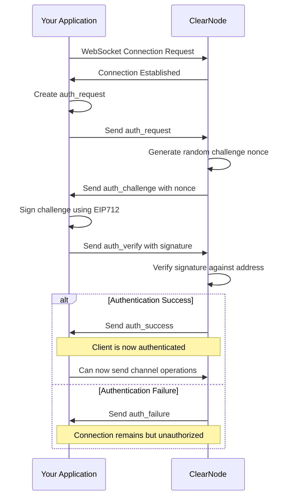

import Tabs from '@theme/Tabs';
import TabItem from '@theme/TabItem';

# Connect to the ClearNode

A ClearNode is a specialized service that facilitates off-chain communication, message relay, and state validation in the Nitrolite ecosystem. This guide explains how to establish and manage connections to a ClearNode using the NitroliteRPC protocol.

## What is a ClearNode?

A **[ClearNode](https://github.com/erc7824/clearnode)** is an implementation of a message broker for the Clearnet protocol. It serves as a critical infrastructure component in the Nitrolite ecosystem, providing several important functions in the state channel network:

- **Multi-Chain Support**: Connect to multiple EVM blockchains (Polygon, Celo, Base)
- **Off-Chain Payments**: Efficient payment channels for high-throughput transactions
- **Virtual Applications**: Create multi-participant applications
- **Quorum-Based Signatures**: Support for multi-signature schemes with weight-based quorums

## Understanding NitroliteRPC

NitroliteRPC is a utility in our SDK that standardizes message creation for communication with ClearNodes. It's not a full protocol implementation but rather a set of helper functions that ensure your application constructs properly formatted messages for ClearNode interaction.

Key functions of NitroliteRPC include:

- **Message Construction**: Creates properly formatted request messages
- **Signature Management**: Handles the cryptographic signing of messages
- **Standard Format Enforcement**: Ensures all messages follow the required format for ClearNode compatibility
- **Authentication Flow Helpers**: Simplifies the authentication process

Under the hood, NitroliteRPC provides functions that generate message objects with the correct structure, timestamps, and signature formatting so you don't have to build these messages manually when communicating with ClearNodes.

## Connecting to a ClearNode

After initializing your client and creating a channel, you need to establish a WebSocket connection to a ClearNode. It's important to understand that the Nitrolite SDK doesn't provide its own transport layer - you'll need to implement the WebSocket connection yourself using your preferred library.

<Tabs>
  <TabItem value="basic" label="WebSocket Connection">

```javascript
// Import your preferred WebSocket library
import WebSocket from 'ws'; // Node.js
// or use the browser's built-in WebSocket

// Create a WebSocket connection to the ClearNode
const ws = new WebSocket('wss://clearnode.example.com');

// Set up basic event handlers
ws.onopen = () => {
  console.log('WebSocket connection established');
  // Connection is open, can now proceed with authentication
};

ws.onmessage = (event) => {
  const message = JSON.parse(event.data);
  console.log('Received message:', message);
  // Process incoming messages
};

ws.onerror = (error) => {
  console.error('WebSocket error:', error);
};

ws.onclose = (event) => {
  console.log(`WebSocket closed: ${event.code} ${event.reason}`);
};
```

  </TabItem>
  <TabItem value="advanced" label="With Reconnection Logic">

```javascript
class ClearNodeConnection {
  constructor(url) {
    this.url = url;
    this.ws = null;
    this.isConnected = false;
    this.reconnectAttempts = 0;
    this.maxReconnectAttempts = 5;
    this.reconnectInterval = 3000; // ms
    this.messageHandlers = new Map();
  }
  
  // Register message handlers
  onMessage(type, handler) {
    this.messageHandlers.set(type, handler);
  }
  
  connect() {
    this.ws = new WebSocket(this.url);
    
    this.ws.onopen = this.handleOpen.bind(this);
    this.ws.onmessage = this.handleMessage.bind(this);
    this.ws.onerror = this.handleError.bind(this);
    this.ws.onclose = this.handleClose.bind(this);
  }
  
  handleOpen() {
    console.log(`Connected to ClearNode at ${this.url}`);
    this.isConnected = true;
    this.reconnectAttempts = 0;
    
    // Emit connected event
    this.emit('connected');
  }
  
  handleMessage(event) {
    try {
      const message = JSON.parse(event.data);
      
      // Determine message type (auth_challenge, auth_success, etc.)
      const messageType = message.res ? message.res[1] : 'unknown';
      
      // Emit specific message event
      this.emit('message', message);
      
      // Call specific handler if registered
      if (this.messageHandlers.has(messageType)) {
        this.messageHandlers.get(messageType)(message);
      }
    } catch (error) {
      console.error('Error handling message:', error);
    }
  }
  
  handleError(error) {
    console.error('WebSocket error:', error);
    this.emit('error', error);
  }
  
  handleClose(event) {
    this.isConnected = false;
    console.log(`WebSocket closed: ${event.code} ${event.reason}`);
    
    // Emit disconnected event
    this.emit('disconnected', event);
    
    // Attempt to reconnect
    this.attemptReconnect();
  }
  
  attemptReconnect() {
    if (this.reconnectAttempts >= this.maxReconnectAttempts) {
      console.error('Maximum reconnection attempts reached');
      return;
    }
    
    this.reconnectAttempts++;
    const delay = this.reconnectInterval * Math.pow(2, this.reconnectAttempts - 1);
    
    console.log(`Attempting to reconnect in ${delay}ms (${this.reconnectAttempts}/${this.maxReconnectAttempts})`);
    
    setTimeout(() => {
      console.log('Reconnecting...');
      this.connect();
    }, delay);
  }
  
  send(message) {
    if (!this.isConnected) {
      console.error('Cannot send message: not connected');
      return false;
    }
    
    try {
      this.ws.send(typeof message === 'string' ? message : JSON.stringify(message));
      return true;
    } catch (error) {
      console.error('Error sending message:', error);
      return false;
    }
  }
  
  disconnect() {
    if (this.ws) {
      this.ws.close(1000, 'User initiated disconnect');
    }
  }
  
  // Simple event system
  #events = {};
  
  on(event, callback) {
    if (!this.#events[event]) this.#events[event] = [];
    this.#events[event].push(callback);
    return this;
  }
  
  off(event, callback) {
    if (!this.#events[event]) return this;
    if (!callback) {
      delete this.#events[event];
      return this;
    }
    this.#events[event] = this.#events[event].filter(cb => cb !== callback);
    return this;
  }
  
  emit(event, ...args) {
    if (!this.#events[event]) return false;
    this.#events[event].forEach(callback => callback(...args));
    return true;
  }
}

// Usage
const clearNodeConnection = new ClearNodeConnection('wss://clearnode.example.com');
clearNodeConnection.connect();

// Register event handlers
clearNodeConnection.on('connected', () => {
  console.log('Connection established, ready to authenticate');
});

// Later, when you're done
clearNodeConnection.disconnect();
```

  </TabItem>
</Tabs>

## Authentication Flow

When connecting to a ClearNode, you need to follow a specific authentication flow using the NitroliteRPC utility to create properly formatted and signed messages:

1. **Initial Connection**: The client establishes a WebSocket connection to the ClearNode's URL
2. **Auth Request**: On the first connection client sends an `auth_request` message with its identity information
3. **Challenge**: The ClearNode responds with an `auth_challenge` containing a random nonce
4. **Signature Verification**: The client signs the challenge along with session key and allowances using EIP712 signature and sends an `auth_verify` message
5. **Auth Result**: The ClearNode verifies the signature and responds with `auth_success` or `auth_failure`
6. **Reconnection**: On success ClearNode will return the JWT Token, which can be used for subsequent reconnections without needing to re-authenticate.

This flow ensures that only authorized participants with valid signing keys can connect to the ClearNode and participate in channel operations.



<Tabs>
  <TabItem value="auth" label="Authentication Process">

```javascript
import {
  createAuthRequestMessage, 
  createAuthVerifyMessage, 
  createEIP712AuthMessageSigner, 
  parseRPCResponse,
  RPCMethod,
} from '@erc7824/nitrolite';
import { ethers } from 'ethers';

// Create and send auth_request
const authRequestMsg = await createAuthRequestMessage({
  address: '0xYourWalletAddress',
  session_key: '0xYourSignerAddress',
  application: 'YourAppDomain',
  expires_at: (Math.floor(Date.now() / 1000) + 3600).toString(), // 1 hour expiration (as string)
  scope: 'console',
  allowances: [],
});

// After WebSocket connection is established
ws.onopen = async () => {
  console.log('WebSocket connection established');
  
  ws.send(authRequestMsg);
};

// Handle incoming messages
ws.onmessage = async (event) => {
  try {
    const message = parseRPCResponse(event.data);
    
    // Handle auth_challenge response
    switch (message.method) {
      case RPCMethod.AuthChallenge:
        console.log('Received auth challenge');

        // Create EIP-712 message signer function
        const eip712MessageSigner = createEIP712AuthMessageSigner(
          walletClient, // Your wallet client instance
          {  
            // EIP-712 message structure, data should match auth_request
            scope: authRequestMsg.scope,
            application: authRequestMsg.application,
            participant: authRequestMsg.participant,
            expires_at: authRequestMsg.expires_at,
            allowances: authRequestMsg.allowances,
          },
          { 
            // Domain for EIP-712 signing
            name: 'Your Domain',
          },
        )
        
        // Create and send auth_verify with signed challenge
        const authVerifyMsg = await createAuthVerifyMessage(
          eip712MessageSigner, // Our custom eip712 signer function
          message,
        );
        
        ws.send(authVerifyMsg);
        break;
      // Handle auth_success or auth_failure
      case RPCMethod.AuthVerify:
        if (!message.params.success) {
          console.log('Authentication failed');
          return;
        }
        console.log('Authentication successful');
        // Now you can start using the channel

        window.localStorage.setItem('clearnode_jwt', message.params.jwtToken); // Store JWT token for future use
        break;
      case RPCMethod.Error: {
        console.error('Authentication failed:', message.params.error);
      }
    }
  } catch (error) {
    console.error('Error handling message:', error);
  }
};
```

  </TabItem>
  <TabItem value="challenge" label="Manual Challenge Handling">

```javascript
import { 
  createAuthRequestMessage, 
  createAuthVerifyMessageFromChallenge,
  createGetLedgerBalancesMessage,
  createGetConfigMessage,
  createEIP712AuthMessageSigner, 
  parseRPCResponse,
  RPCMethod,
} from '@erc7824/nitrolite';
import { ethers } from 'ethers';

// After connection is established, send auth request
ws.onopen = async () => {
  const authRequestMsg = await createAuthRequestMessage({
    address: '0xYourWalletAddress',
    session_key: '0xYourSignerAddress',
    application: 'YourAppDomain',
    expires_at: (Math.floor(Date.now() / 1000) + 3600).toString(), // 1 hour expiration (as string)
    scope: 'console',
    allowances: [],
  });
  ws.send(authRequestMsg);
};

// If you want to manually extract and handle the challenge
ws.onmessage = async (event) => {
  try {
    const message = parseRPCResponse(event.data);
    
    if (message.method === RPCMethod.AuthChallenge) {
      // Extract the challenge manually from the response
      if (
        message.params.challengeMessage
      ) {
        const challenge = message.params.challengeMessage;

        // Create EIP-712 message signer function
        const eip712MessageSigner = createEIP712AuthMessageSigner(
          walletClient, // Your wallet client instance
          {  
            // EIP-712 message structure, data should match auth_request
            scope: authRequestMsg.scope,
            application: authRequestMsg.application,
            participant: authRequestMsg.participant,
            expires_at: authRequestMsg.expires_at,
            allowances: authRequestMsg.allowances,
          },
          { 
            // Domain for EIP-712 signing
            name: 'Your Domain',
          },
        )
        
        // Create auth_verify with the explicitly provided challenge
        const authVerifyMsg = await createAuthVerifyMessageFromChallenge(
          eip712MessageSigner,
          challenge
        );
        
        ws.send(authVerifyMsg);
      } else {
        console.error('Malformed challenge response');
      }
    }
  } catch (error) {
    console.error('Error handling message:', error);
  }
};
```

  </TabItem>
  <TabItem value="reconnect" label="Reconnect">

```javascript
import { createAuthVerifyMessageWithJWT, parseRPCResponse, RPCMethod } from '@erc7824/nitrolite';
import { ethers } from 'ethers';

// After WebSocket connection is established
ws.onopen = async () => {
  console.log('WebSocket connection established');
  
  // Create and send auth_verify with JWT for reconnection
  // Get the stored JWT token
  const jwtToken = window.localStorage.getItem('clearnode_jwt');

  const authRequestMsg = await createAuthVerifyMessageWithJWT(
    jwtToken, // JWT token for reconnection
  );
  
  ws.send(authRequestMsg);
};

// Handle incoming messages
ws.onmessage = async (event) => {
  try {
    const message = parseRPCResponse(event.data);
    
      // Handle auth_success or auth_failure
    switch (message.method) {
      case RPCMethod.AuthVerify:
        if (message.params.success) {
          console.log('Authentication successful');
          // Now you can start using the channel
        }
        break;
      case RPCMethod.Error:
        console.error('Authentication failed:', message.params.error);
        break;
    }
  } catch (error) {
    console.error('Error handling message:', error);
  }
};
```

  </TabItem>
</Tabs>

### EIP-712 Signature

In the authentication process, the client must sign messages using EIP-712 structured data signatures. This ensures that the messages are tamper-proof and verifiable by the ClearNode.

The format of the EIP-712 message is as follows:

```javascript
{
  "types": {
    "EIP712Domain": [
      { "name": "name", "type": "string" }
    ],
    "Policy": [
      { "name": "challenge", "type": "string" },
      { "name": "scope", "type": "string" },
      { "name": "wallet", "type": "address" },
      { "name": "session_key", "type": "address" },
      { "name": "expires_at", "type": "uint64" },
      { "name": "allowances", "type": "Allowance[]" }
    ],
    "Allowance": [
      { "name": "asset", "type": "string" },
      { "name": "amount", "type": "string" }
    ]
  },
  // Domain and primary type
  domain: {
    name: 'Your App Domain'
  },
  primaryType: 'Policy',
  message: {
    challenge: 'RandomChallengeString',
    scope: 'console',
    wallet: '0xYourWalletAddress',
    session_key: '0xYourSignerAddress',
    expires_at: 1762417301,
    allowances: []
  }
}
```

### Message Signer

In methods that require signing messages, that are not part of the authentication flow, you should use a custom message signer function `MessageSigner`. This function takes the payload and returns a signed message that can be sent to the ClearNode using ECDSA signature.

There are also, several things to consider: this method SHOULD sign plain JSON payloads and NOT [ERC-191](https://eips.ethereum.org/EIPS/eip-191) data, because it allows signatures to be compatible with non-EVM chains. Since most of the libraries, like `ethers` or `viem`, use EIP-191 by default, you will need to overwrite the default behavior to sign plain JSON payloads.
The other thing to consider is that providing an EOA private key directly in the code is not recommended for production applications. Instead, we are recommending to generate session keys -- temporary keys that are used for signing messages during the session. This way, you can avoid exposing your main wallet's private key and reduce the risk of compromising your funds.

The simplest implementation of a message signer function looks like this:

> **Warning**
> For this example use `ethers` library version `5.7.2`. The `ethers` library version `6.x` has breaking changes that are not allowed in this example.

```javascript
import { MessageSigner, RequestData, ResponsePayload } from '@erc7824/nitrolite';
import { ethers } from 'ethers';
import { Hex } from 'viem';

const messageSigner = async (payload: RequestData | ResponsePayload): Promise<Hex> => {
    try {
        const wallet = new ethers.Wallet('0xYourPrivateKey');

        const messageBytes = ethers.utils.arrayify(ethers.utils.id(JSON.stringify(payload)));

        const flatSignature = await wallet._signingKey().signDigest(messageBytes);

        const signature = ethers.utils.joinSignature(flatSignature);

        return signature as Hex;
    } catch (error) {
        console.error('Error signing message:', error);
        throw error;
    }
}
```

## Getting Channel Information

After authenticating with a ClearNode, you can request information about your channels. This is useful to verify your connection is working correctly and to retrieve channel data.

```javascript
import { createGetChannelsMessage, parseRPCResponse, RPCMethod } from '@erc7824/nitrolite';

// Example of using the function after authentication is complete
ws.addEventListener('message', async (event) => {
  const message = parseRPCResponse(event.data);
  
  // Check if this is a successful authentication message
  if (message.method === RPCMethod.AuthVerify && message.params.success) {
    console.log('Successfully authenticated, requesting channel information...');
    
    // Request channel information using the built-in helper function
    const getChannelsMsg = await createGetChannelsMessage(
      messageSigner, // Provide message signer function from previous example
      client.stateWalletSigner.getAddress()
    );
    
    ws.send(getChannelsMsg);
  }
  
  // Handle get_channels response
  if (message.method === RPCMethod.GetChannels) {
    console.log('Received channels information:');
    const channelsList = message.params;
    
    if (channelsList && channelsList.length > 0) {
      channelsList.forEach((channel, index) => {
        console.log(`Channel ${index + 1}:`);
        console.log(`- Channel ID: ${channel.channel_id}`);
        console.log(`- Status: ${channel.status}`);
        console.log(`- Participant: ${channel.participant}`);
        console.log(`- Token: ${channel.token}`);
        console.log(`- Amount: ${channel.amount}`);
        console.log(`- Chain ID: ${channel.chain_id}`);
        console.log(`- Adjudicator: ${channel.adjudicator}`);
        console.log(`- Challenge: ${channel.challenge}`);
        console.log(`- Nonce: ${channel.nonce}`);
        console.log(`- Version: ${channel.version}`);
        console.log(`- Created: ${channel.created_at}`);
        console.log(`- Updated: ${channel.updated_at}`);
      });
    } else {
      console.log('No active channels found');
    }
  }
});
```

### Response Format

The response to a `get_channels` request includes detailed information about each channel:

```javascript
{
  "res": [1, "get_channels", [[  // Notice the nested array structure
    {
      "channel_id": "0xfedcba9876543210...",
      "participant": "0x1234567890abcdef...",
      "status": "open", // Can be "open", "closed", "settling", etc.
      "token": "0xeeee567890abcdef...", // ERC20 token address
      "amount": "100000", // Current channel balance
      "chain_id": 137, // Chain ID (e.g., 137 for Polygon)
      "adjudicator": "0xAdjudicatorContractAddress...", // Contract address
      "challenge": 86400, // Challenge period in seconds
      "nonce": 1,
      "version": 2,
      "created_at": "2023-05-01T12:00:00Z",
      "updated_at": "2023-05-01T12:30:00Z"
    }
  ]], 1619123456789],
  "sig": ["0xabcd1234..."]
}
```

## Framework-Specific Integration

Here are examples of integrating ClearNode WebSocket connections with various frameworks. Since the Nitrolite SDK doesn't provide its own transport layer, these examples show how to implement WebSocket connections and the NitroliteRPC message format in different frameworks.

<Tabs>
  <TabItem value="react" label="React">

```javascript
import { useState, useEffect, useCallback } from 'react';
import { ethers } from 'ethers';
import { 
  createAuthRequestMessage, 
  createAuthVerifyMessage,
  createGetChannelsMessage,
  createGetLedgerBalancesMessage,
  createGetConfigMessage,
  generateRequestId, 
  getCurrentTimestamp 
} from '@erc7824/nitrolite';

// Custom hook for ClearNode connection
function useClearNodeConnection(clearNodeUrl, stateWallet) {
  const [ws, setWs] = useState(null);
  const [connectionStatus, setConnectionStatus] = useState('disconnected');
  const [isAuthenticated, setIsAuthenticated] = useState(false);
  const [error, setError] = useState(null);
  
  // Message signer function
  const messageSigner = useCallback(async (payload) => {
    if (!stateWallet) throw new Error('State wallet not available');
    
    try {
      const message = JSON.stringify(payload);
      const digestHex = ethers.id(message);
      const messageBytes = ethers.getBytes(digestHex);
      const { serialized: signature } = stateWallet.signingKey.sign(messageBytes);
      return signature;
    } catch (error) {
      console.error("Error signing message:", error);
      throw error;
    }
  }, [stateWallet]);
  
  // Create a signed request
  const createSignedRequest = useCallback(async (method, params = []) => {
    if (!stateWallet) throw new Error('State wallet not available');
    
    const requestId = generateRequestId();
    const timestamp = getCurrentTimestamp();
    const requestData = [requestId, method, params, timestamp];
    const request = { req: requestData };
    
    // Sign the request
    const message = JSON.stringify(request);
    const digestHex = ethers.id(message);
    const messageBytes = ethers.getBytes(digestHex);
    const { serialized: signature } = stateWallet.signingKey.sign(messageBytes);
    request.sig = [signature];
    
    return JSON.stringify(request);
  }, [stateWallet]);
  
  // Send a message to the ClearNode
  const sendMessage = useCallback((message) => {
    if (!ws || ws.readyState !== WebSocket.OPEN) {
      setError('WebSocket not connected');
      return false;
    }
    
    try {
      ws.send(typeof message === 'string' ? message : JSON.stringify(message));
      return true;
    } catch (error) {
      setError(`Error sending message: ${error.message}`);
      return false;
    }
  }, [ws]);
  
  // Connect to the ClearNode
  const connect = useCallback(() => {
    if (ws) {
      ws.close();
    }
    
    setConnectionStatus('connecting');
    setError(null);
    
    const newWs = new WebSocket(clearNodeUrl);
    
    newWs.onopen = async () => {
      setConnectionStatus('connected');
      
      // Start authentication process
      try {
        const authRequest = await createAuthRequestMessage(
          messageSigner,
          stateWallet.address
        );
        newWs.send(authRequest);
      } catch (err) {
        setError(`Authentication request failed: ${err.message}`);
      }
    };
    
    newWs.onmessage = async (event) => {
      try {
        const message = JSON.parse(event.data);
        
        // Handle authentication flow
        if (message.res && message.res[1] === 'auth_challenge') {
          try {
            const authVerify = await createAuthVerifyMessage(
              messageSigner,
              message,
              stateWallet.address
            );
            newWs.send(authVerify);
          } catch (err) {
            setError(`Authentication verification failed: ${err.message}`);
          }
        } else if (message.res && message.res[1] === 'auth_success') {
          setIsAuthenticated(true);
        } else if (message.res && message.res[1] === 'auth_failure') {
          setIsAuthenticated(false);
          setError(`Authentication failed: ${message.res[2]}`);
        }
        
        // Additional message handling can be added here
      } catch (err) {
        console.error('Error handling message:', err);
      }
    };
    
    newWs.onerror = (error) => {
      setError(`WebSocket error: ${error.message}`);
      setConnectionStatus('error');
    };
    
    newWs.onclose = () => {
      setConnectionStatus('disconnected');
      setIsAuthenticated(false);
    };
    
    setWs(newWs);
  }, [clearNodeUrl, messageSigner, stateWallet]);
  
  // Disconnect from the ClearNode
  const disconnect = useCallback(() => {
    if (ws) {
      ws.close();
      setWs(null);
    }
  }, [ws]);
  
  // Connect when the component mounts
  useEffect(() => {
    if (clearNodeUrl && stateWallet) {
      connect();
    }
    
    // Clean up on unmount
    return () => {
      if (ws) {
        ws.close();
      }
    };
  }, [clearNodeUrl, stateWallet, connect]);
  
  // Create helper methods for common operations
  const getChannels = useCallback(async () => {
    // Using the built-in helper function from NitroliteRPC
    const message = await createGetChannelsMessage(
      messageSigner,
      stateWallet.address
    );
    return sendMessage(message);
  }, [messageSigner, sendMessage, stateWallet]);
  
  const getLedgerBalances = useCallback(async (channelId) => {
    // Using the built-in helper function from NitroliteRPC
    const message = await createGetLedgerBalancesMessage(
      messageSigner,
      channelId
    );
    return sendMessage(message);
  }, [messageSigner, sendMessage]);
  
  const getConfig = useCallback(async () => {
    // Using the built-in helper function from NitroliteRPC
    const message = await createGetConfigMessage(
      messageSigner,
      stateWallet.address
    );
    return sendMessage(message);
  }, [messageSigner, sendMessage, stateWallet]);
  
  return {
    connectionStatus,
    isAuthenticated,
    error,
    ws,
    connect,
    disconnect,
    sendMessage,
    getChannels,
    getLedgerBalances,
    getConfig,
    createSignedRequest
  };
}

// Example usage in a component
function ClearNodeComponent() {
  const stateWallet = /* your state wallet initialization */;
  const {
    connectionStatus,
    isAuthenticated,
    error,
    getChannels
  } = useClearNodeConnection('wss://clearnode.example.com', stateWallet);
  
  return (
    <div>
      <p>Status: {connectionStatus}</p>
      <p>Authenticated: {isAuthenticated ? 'Yes' : 'No'}</p>
      {error && <p className="error">Error: {error}</p>}
      
      <button 
        onClick={getChannels} 
        disabled={!isAuthenticated}
      >
        Get Channels
      </button>
    </div>
  );
}
```

  </TabItem>
  <TabItem value="angular" label="Angular">

```typescript
// In an Angular service (clearnode.service.ts)
import { Injectable } from '@angular/core';
import { BehaviorSubject, Observable } from 'rxjs';
import { ethers } from 'ethers';
import { 
  createAuthRequestMessage, 
  createAuthVerifyMessage,
  createGetChannelsMessage,
  createGetLedgerBalancesMessage,
  createGetConfigMessage,
  generateRequestId, 
  getCurrentTimestamp 
} from '@erc7824/nitrolite';

@Injectable({
  providedIn: 'root'
})
export class ClearNodeService {
  private ws: WebSocket | null = null;
  private connectionStatusSource = new BehaviorSubject<string>('disconnected');
  private isAuthenticatedSource = new BehaviorSubject<boolean>(false);
  private errorSource = new BehaviorSubject<string | null>(null);
  private messageSubject = new BehaviorSubject<any>(null);
  
  // Public observables
  connectionStatus$ = this.connectionStatusSource.asObservable();
  isAuthenticated$ = this.isAuthenticatedSource.asObservable();
  error$ = this.errorSource.asObservable();
  message$ = this.messageSubject.asObservable();
  
  // Custom message signer
  private async messageSigner(payload: any, stateWallet: any): Promise<string> {
    try {
      const message = JSON.stringify(payload);
      const digestHex = ethers.id(message);
      const messageBytes = ethers.getBytes(digestHex);
      const { serialized: signature } = stateWallet.signingKey.sign(messageBytes);
      return signature;
    } catch (error) {
      console.error("Error signing message:", error);
      throw error;
    }
  }
  
  // Create a signed request
  async createSignedRequest(method: string, params: any[], stateWallet: any): Promise<string> {
    const requestId = generateRequestId();
    const timestamp = getCurrentTimestamp();
    const requestData = [requestId, method, params, timestamp];
    const request: any = { req: requestData };
    
    // Sign the request
    const message = JSON.stringify(request);
    const digestHex = ethers.id(message);
    const messageBytes = ethers.getBytes(digestHex);
    const { serialized: signature } = stateWallet.signingKey.sign(messageBytes);
    request.sig = [signature];
    
    return JSON.stringify(request);
  }
  
  // Connect to the ClearNode
  connect(url: string, stateWallet: any): void {
    if (this.ws) {
      this.ws.close();
    }
    
    this.connectionStatusSource.next('connecting');
    this.errorSource.next(null);
    
    this.ws = new WebSocket(url);
    
    this.ws.onopen = async () => {
      this.connectionStatusSource.next('connected');
      
      // Start authentication process
      try {
        const authRequest = await createAuthRequestMessage(
          (payload) => this.messageSigner(payload, stateWallet),
          stateWallet.address
        );
        this.ws!.send(authRequest);
      } catch (err: any) {
        this.errorSource.next(`Authentication request failed: ${err.message}`);
      }
    };
    
    this.ws.onmessage = async (event) => {
      try {
        const message = JSON.parse(event.data);
        this.messageSubject.next(message);
        
        // Handle authentication flow
        if (message.res && message.res[1] === 'auth_challenge') {
          try {
            const authVerify = await createAuthVerifyMessage(
              (payload) => this.messageSigner(payload, stateWallet),
              message,
              stateWallet.address
            );
            this.ws!.send(authVerify);
          } catch (err: any) {
            this.errorSource.next(`Authentication verification failed: ${err.message}`);
          }
        } else if (message.res && message.res[1] === 'auth_success') {
          this.isAuthenticatedSource.next(true);
        } else if (message.res && message.res[1] === 'auth_failure') {
          this.isAuthenticatedSource.next(false);
          this.errorSource.next(`Authentication failed: ${message.res[2]}`);
        }
      } catch (err: any) {
        console.error('Error handling message:', err);
      }
    };
    
    this.ws.onerror = (error) => {
      this.errorSource.next(`WebSocket error`);
      this.connectionStatusSource.next('error');
    };
    
    this.ws.onclose = () => {
      this.connectionStatusSource.next('disconnected');
      this.isAuthenticatedSource.next(false);
    };
  }
  
  // Disconnect from the ClearNode
  disconnect(): void {
    if (this.ws) {
      this.ws.close();
      this.ws = null;
    }
  }
  
  // Send a message to the ClearNode
  sendMessage(message: string | object): boolean {
    if (!this.ws || this.ws.readyState !== WebSocket.OPEN) {
      this.errorSource.next('WebSocket not connected');
      return false;
    }
    
    try {
      this.ws.send(typeof message === 'string' ? message : JSON.stringify(message));
      return true;
    } catch (error: any) {
      this.errorSource.next(`Error sending message: ${error.message}`);
      return false;
    }
  }
  
  // Helper methods for common operations
  async getChannels(stateWallet: any): Promise<boolean> {
    // Using the built-in helper function from NitroliteRPC
    const message = await createGetChannelsMessage(
      (payload) => this.messageSigner(payload, stateWallet),
      stateWallet.address
    );
    return this.sendMessage(message);
  }
  
  async getLedgerBalances(channelId: string, stateWallet: any): Promise<boolean> {
    // Using the built-in helper function from NitroliteRPC
    const message = await createGetLedgerBalancesMessage(
      (payload) => this.messageSigner(payload, stateWallet),
      channelId
    );
    return this.sendMessage(message);
  }
  
  async getConfig(stateWallet: any): Promise<boolean> {
    // Using the built-in helper function from NitroliteRPC
    const message = await createGetConfigMessage(
      (payload) => this.messageSigner(payload, stateWallet),
      stateWallet.address
    );
    return this.sendMessage(message);
  }
}

// Usage in a component
import { Component, OnInit, OnDestroy } from '@angular/core';
import { ClearNodeService } from './clearnode.service';
import { Subscription } from 'rxjs';

@Component({
  selector: 'app-clearnode',
  template: `
    <div>
      <p>Status: {{ connectionStatus }}</p>
      <p>Authenticated: {{ isAuthenticated ? 'Yes' : 'No' }}</p>
      <p *ngIf="error" class="error">Error: {{ error }}</p>
      
      <button 
        (click)="getChannels()" 
        [disabled]="!isAuthenticated"
      >
        Get Channels
      </button>
    </div>
  `
})
export class ClearNodeComponent implements OnInit, OnDestroy {
  connectionStatus = 'disconnected';
  isAuthenticated = false;
  error: string | null = null;
  
  private subscriptions: Subscription[] = [];
  private stateWallet: any; // Initialize your state wallet
  
  constructor(private clearNodeService: ClearNodeService) {}
  
  ngOnInit() {
    this.subscriptions.push(
      this.clearNodeService.connectionStatus$.subscribe(
        status => this.connectionStatus = status
      ),
      this.clearNodeService.isAuthenticated$.subscribe(
        auth => this.isAuthenticated = auth
      ),
      this.clearNodeService.error$.subscribe(
        err => this.error = err
      ),
      this.clearNodeService.message$.subscribe(
        message => {
          if (message) {
            console.log('Received message:', message);
            // Handle specific message types here
          }
        }
      )
    );
    
    // Connect to ClearNode
    this.clearNodeService.connect('wss://clearnode.example.com', this.stateWallet);
  }
  
  ngOnDestroy() {
    this.clearNodeService.disconnect();
    this.subscriptions.forEach(sub => sub.unsubscribe());
  }
  
  getChannels() {
    this.clearNodeService.getChannels(this.stateWallet);
  }
}
```

  </TabItem>
  <TabItem value="vue" label="Vue">

```javascript
// In a Vue component or Composable
import { ref, onMounted, onUnmounted } from 'vue';
import { ethers } from 'ethers';
import { 
  createAuthRequestMessage, 
  createAuthVerifyMessage,
  createGetChannelsMessage,
  createGetLedgerBalancesMessage,
  createGetConfigMessage,
  generateRequestId, 
  getCurrentTimestamp 
} from '@erc7824/nitrolite';

// ClearNode connection composable
export function useClearNodeConnection(clearNodeUrl, stateWallet) {
  const ws = ref(null);
  const connectionStatus = ref('disconnected');
  const isAuthenticated = ref(false);
  const error = ref(null);
  const messages = ref([]);
  
  // Message signer function
  const messageSigner = async (payload) => {
    try {
      const message = JSON.stringify(payload);
      const digestHex = ethers.id(message);
      const messageBytes = ethers.getBytes(digestHex);
      const { serialized: signature } = stateWallet.signingKey.sign(messageBytes);
      return signature;
    } catch (error) {
      console.error("Error signing message:", error);
      throw error;
    }
  };
  
  // Create a signed request
  const createSignedRequest = async (method, params = []) => {
    const requestId = generateRequestId();
    const timestamp = getCurrentTimestamp();
    const requestData = [requestId, method, params, timestamp];
    const request = { req: requestData };
    
    // Sign the request
    const message = JSON.stringify(request);
    const digestHex = ethers.id(message);
    const messageBytes = ethers.getBytes(digestHex);
    const { serialized: signature } = stateWallet.signingKey.sign(messageBytes);
    request.sig = [signature];
    
    return JSON.stringify(request);
  };
  
  // Send a message to the ClearNode
  const sendMessage = (message) => {
    if (!ws.value || ws.value.readyState !== WebSocket.OPEN) {
      error.value = 'WebSocket not connected';
      return false;
    }
    
    try {
      ws.value.send(typeof message === 'string' ? message : JSON.stringify(message));
      return true;
    } catch (err) {
      error.value = `Error sending message: ${err.message}`;
      return false;
    }
  };
  
  // Connect to the ClearNode
  const connect = () => {
    if (ws.value) {
      ws.value.close();
    }
    
    connectionStatus.value = 'connecting';
    error.value = null;
    
    const newWs = new WebSocket(clearNodeUrl);
    
    newWs.onopen = async () => {
      connectionStatus.value = 'connected';
      
      // Start authentication process
      try {
        const authRequest = await createAuthRequestMessage(
          messageSigner,
          stateWallet.address
        );
        newWs.send(authRequest);
      } catch (err) {
        error.value = `Authentication request failed: ${err.message}`;
      }
    };
    
    newWs.onmessage = async (event) => {
      try {
        const message = JSON.parse(event.data);
        messages.value.push(message);
        
        // Handle authentication flow
        if (message.res && message.res[1] === 'auth_challenge') {
          try {
            const authVerify = await createAuthVerifyMessage(
              messageSigner,
              message,
              stateWallet.address
            );
            newWs.send(authVerify);
          } catch (err) {
            error.value = `Authentication verification failed: ${err.message}`;
          }
        } else if (message.res && message.res[1] === 'auth_success') {
          isAuthenticated.value = true;
        } else if (message.res && message.res[1] === 'auth_failure') {
          isAuthenticated.value = false;
          error.value = `Authentication failed: ${message.res[2]}`;
        }
      } catch (err) {
        console.error('Error handling message:', err);
      }
    };
    
    newWs.onerror = (err) => {
      error.value = 'WebSocket error';
      connectionStatus.value = 'error';
    };
    
    newWs.onclose = () => {
      connectionStatus.value = 'disconnected';
      isAuthenticated.value = false;
    };
    
    ws.value = newWs;
  };
  
  // Disconnect from the ClearNode
  const disconnect = () => {
    if (ws.value) {
      ws.value.close();
      ws.value = null;
    }
  };
  
  // Helper methods for common operations
  const getChannels = async () => {
    // Using the built-in helper function from NitroliteRPC
    const message = await createGetChannelsMessage(
      messageSigner,
      stateWallet.address
    );
    return sendMessage(message);
  };
  
  const getLedgerBalances = async (channelId) => {
    // Using the built-in helper function from NitroliteRPC
    const message = await createGetLedgerBalancesMessage(
      messageSigner,
      channelId
    );
    return sendMessage(message);
  };
  
  const getConfig = async () => {
    // Using the built-in helper function from NitroliteRPC
    const message = await createGetConfigMessage(
      messageSigner,
      stateWallet.address
    );
    return sendMessage(message);
  };
  
  // Connect and disconnect with the component lifecycle
  onMounted(() => {
    if (clearNodeUrl && stateWallet) {
      connect();
    }
  });
  
  onUnmounted(() => {
    disconnect();
  });
  
  return {
    connectionStatus,
    isAuthenticated,
    error,
    messages,
    connect,
    disconnect,
    sendMessage,
    getChannels,
    getLedgerBalances,
    getConfig,
    createSignedRequest
  };
}

// Example usage in a Vue component
export default {
  setup() {
    // Initialize your state wallet
    const stateWallet = {}; 
    
    const {
      connectionStatus,
      isAuthenticated,
      error,
      messages,
      getChannels,
      getLedgerBalances,
      getConfig
    } = useClearNodeConnection('wss://clearnode.example.com', stateWallet);
    
    return {
      connectionStatus,
      isAuthenticated,
      error,
      messages,
      getChannels,
      getLedgerBalances,
      getConfig
    };
  }
};
```

  </TabItem>
  <TabItem value="nodejs" label="Node.js">

```javascript
const WebSocket = require('ws');
const { ethers } = require('ethers');
const { 
  createAuthRequestMessage, 
  createAuthVerifyMessage,
  createGetLedgerBalancesMessage,
  createGetConfigMessage,
  generateRequestId, 
  getCurrentTimestamp 
} = require('@erc7824/nitrolite');
const EventEmitter = require('events');

class ClearNodeConnection extends EventEmitter {
  constructor(url, stateWallet) {
    super();
    this.url = url;
    this.stateWallet = stateWallet;
    this.ws = null;
    this.isConnected = false;
    this.isAuthenticated = false;
    this.reconnectAttempts = 0;
    this.maxReconnectAttempts = 5;
    this.reconnectInterval = 3000; // ms
    this.requestMap = new Map(); // Track pending requests
  }
  
  // Message signer function
  async messageSigner(payload) {
    try {
      const message = JSON.stringify(payload);
      const digestHex = ethers.id(message);
      const messageBytes = ethers.getBytes(digestHex);
      const { serialized: signature } = this.stateWallet.signingKey.sign(messageBytes);
      return signature;
    } catch (error) {
      console.error("Error signing message:", error);
      throw error;
    }
  }
  
  // Create a signed request
  async createSignedRequest(method, params = [], requestId = generateRequestId()) {
    const timestamp = getCurrentTimestamp();
    const requestData = [requestId, method, params, timestamp];
    const request = { req: requestData };
    
    // Sign the request
    const message = JSON.stringify(request);
    const digestHex = ethers.id(message);
    const messageBytes = ethers.getBytes(digestHex);
    const { serialized: signature } = this.stateWallet.signingKey.sign(messageBytes);
    request.sig = [signature];
    
    return { request, requestId };
  }
  
  // Connect to the ClearNode
  async connect() {
    return new Promise((resolve, reject) => {
      if (this.ws) {
        this.ws.close();
      }
      
      this.emit('connecting');
      
      this.ws = new WebSocket(this.url);
      
      // Set connection timeout
      const connectionTimeout = setTimeout(() => {
        if (!this.isConnected) {
          this.ws.close();
          reject(new Error('Connection timeout'));
        }
      }, 10000);
      
      this.ws.on('open', async () => {
        clearTimeout(connectionTimeout);
        this.isConnected = true;
        this.reconnectAttempts = 0;
        this.emit('connected');
        
        // Start authentication
        try {
          const authRequest = await createAuthRequestMessage(
            (payload) => this.messageSigner(payload),
            this.stateWallet.address
          );
          
          this.ws.send(authRequest);
          // Do not resolve here, wait for auth_success
        } catch (error) {
          this.emit('error', `Authentication request failed: ${error.message}`);
          reject(error);
        }
      });
      
      this.ws.on('message', async (data) => {
        try {
          const message = JSON.parse(data);
          this.emit('message', message);
          
          // Handle authentication flow
          if (message.res && message.res[1] === 'auth_challenge') {
            try {
              const authVerify = await createAuthVerifyMessage(
                (payload) => this.messageSigner(payload),
                message,
                this.stateWallet.address
              );
              
              this.ws.send(authVerify);
            } catch (error) {
              this.emit('error', `Authentication verification failed: ${error.message}`);
              reject(error);
            }
          } else if (message.res && message.res[1] === 'auth_success') {
            this.isAuthenticated = true;
            this.emit('authenticated');
            resolve(); // Authentication successful
          } else if (message.res && message.res[1] === 'auth_failure') {
            this.isAuthenticated = false;
            const error = new Error(`Authentication failed: ${message.res[2]}`);
            this.emit('error', error.message);
            reject(error);
          }
          
          // Handle other response types
          if (message.res && message.res[0]) {
            const requestId = message.res[0];
            const handler = this.requestMap.get(requestId);
            if (handler) {
              handler.resolve(message);
              this.requestMap.delete(requestId);
            }
          }
        } catch (error) {
          console.error('Error handling message:', error);
        }
      });
      
      this.ws.on('error', (error) => {
        clearTimeout(connectionTimeout);
        this.emit('error', `WebSocket error: ${error.message}`);
        reject(error);
      });
      
      this.ws.on('close', (code, reason) => {
        clearTimeout(connectionTimeout);
        this.isConnected = false;
        this.isAuthenticated = false;
        this.emit('disconnected', { code, reason: reason.toString() });
        
        // Attempt to reconnect
        this.attemptReconnect();
      });
    });
  }
  
  // Send a request and wait for the response
  async sendRequest(method, params = []) {
    if (!this.isConnected || !this.isAuthenticated) {
      throw new Error('Not connected or authenticated');
    }
    
    const { request, requestId } = await this.createSignedRequest(method, params);
    
    return new Promise((resolve, reject) => {
      // Set up response handler
      const timeout = setTimeout(() => {
        this.requestMap.delete(requestId);
        reject(new Error(`Request timeout for ${method}`));
      }, 30000);
      
      this.requestMap.set(requestId, {
        resolve: (response) => {
          clearTimeout(timeout);
          resolve(response);
        },
        reject,
        timeout
      });
      
      // Send the request
      try {
        this.ws.send(JSON.stringify(request));
      } catch (error) {
        clearTimeout(timeout);
        this.requestMap.delete(requestId);
        reject(error);
      }
    });
  }
  
  // Helper methods for common operations
  async getChannels() {
    // Using the built-in helper function from NitroliteRPC
    const message = await createGetChannelsMessage(
      (payload) => this.messageSigner(payload),
      this.stateWallet.address
    );
    
    return new Promise((resolve, reject) => {
      try {
        const parsed = JSON.parse(message);
        const requestId = parsed.req[0];
        
        const timeout = setTimeout(() => {
          this.requestMap.delete(requestId);
          reject(new Error('Request timeout for getChannels'));
        }, 30000);
        
        this.requestMap.set(requestId, {
          resolve: (response) => {
            clearTimeout(timeout);
            resolve(response);
          },
          reject,
          timeout
        });
        
        this.ws.send(message);
      } catch (error) {
        reject(error);
      }
    });
  }
  
  async getLedgerBalances(channelId) {
    // Using the built-in helper function from NitroliteRPC
    const message = await createGetLedgerBalancesMessage(
      (payload) => this.messageSigner(payload),
      channelId
    );
    
    return new Promise((resolve, reject) => {
      try {
        const parsed = JSON.parse(message);
        const requestId = parsed.req[0];
        
        const timeout = setTimeout(() => {
          this.requestMap.delete(requestId);
          reject(new Error('Request timeout for getLedgerBalances'));
        }, 30000);
        
        this.requestMap.set(requestId, {
          resolve: (response) => {
            clearTimeout(timeout);
            resolve(response);
          },
          reject,
          timeout
        });
        
        this.ws.send(message);
      } catch (error) {
        reject(error);
      }
    });
  }
  
  async getConfig() {
    // Using the built-in helper function from NitroliteRPC
    const message = await createGetConfigMessage(
      (payload) => this.messageSigner(payload),
      this.stateWallet.address
    );
    
    return new Promise((resolve, reject) => {
      try {
        const parsed = JSON.parse(message);
        const requestId = parsed.req[0];
        
        const timeout = setTimeout(() => {
          this.requestMap.delete(requestId);
          reject(new Error('Request timeout for getConfig'));
        }, 30000);
        
        this.requestMap.set(requestId, {
          resolve: (response) => {
            clearTimeout(timeout);
            resolve(response);
          },
          reject,
          timeout
        });
        
        this.ws.send(message);
      } catch (error) {
        reject(error);
      }
    });
  }
  
  // Attempt to reconnect with exponential backoff
  attemptReconnect() {
    if (this.reconnectAttempts >= this.maxReconnectAttempts) {
      this.emit('error', 'Maximum reconnection attempts reached');
      return;
    }
    
    this.reconnectAttempts++;
    const delay = this.reconnectInterval * Math.pow(2, this.reconnectAttempts - 1);
    
    this.emit('reconnecting', { attempt: this.reconnectAttempts, delay });
    
    setTimeout(() => {
      this.connect().catch(error => {
        console.error(`Reconnection attempt ${this.reconnectAttempts} failed:`, error);
      });
    }, delay);
  }
  
  // Disconnect from the ClearNode
  disconnect() {
    if (this.ws) {
      // Clear all pending requests
      for (const [requestId, handler] of this.requestMap.entries()) {
        clearTimeout(handler.timeout);
        handler.reject(new Error('Connection closed'));
        this.requestMap.delete(requestId);
      }
      
      this.ws.close(1000, 'User initiated disconnect');
      this.ws = null;
    }
  }
}

// Example usage
async function main() {
  // Initialize your state wallet (this is just a placeholder)
  const privateKey = '0x1234...'; // Your private key
  const stateWallet = new ethers.Wallet(privateKey);
  
  // Create a ClearNode connection
  const clearNode = new ClearNodeConnection('wss://clearnode.example.com', stateWallet);
  
  // Set up event handlers
  clearNode.on('connecting', () => {
    console.log('Connecting to ClearNode...');
  });
  
  clearNode.on('connected', () => {
    console.log('Connected to ClearNode');
  });
  
  clearNode.on('authenticated', () => {
    console.log('Authenticated with ClearNode');
  });
  
  clearNode.on('disconnected', ({ code, reason }) => {
    console.log(`Disconnected from ClearNode: ${code} ${reason}`);
  });
  
  clearNode.on('error', (error) => {
    console.error(`ClearNode error: ${error}`);
  });
  
  clearNode.on('reconnecting', ({ attempt, delay }) => {
    console.log(`Reconnecting (${attempt}/${clearNode.maxReconnectAttempts}) in ${delay}ms...`);
  });
  
  try {
    // Connect and authenticate
    await clearNode.connect();
    console.log('Successfully connected and authenticated');
    
    // Get channels
    const channels = await clearNode.getChannels();
    console.log('Channels:', channels.res[2][0]);
    
    // Process the channels
    const channelList = channels.res[2][0];
    if (channelList && channelList.length > 0) {
      for (const channel of channelList) {
        console.log(`Channel ID: ${channel.channel_id}`);
        console.log(`Status: ${channel.status}`);
        console.log(`Token: ${channel.token}`);
        
        // Get ledger balances for the channel
        if (channel.status === 'open') {
          const balances = await clearNode.getLedgerBalances(channel.channel_id);
          console.log(`Balances:`, balances.res[2]);
        }
      }
    } else {
      console.log('No channels found');
    }
  } catch (error) {
    console.error('Error:', error);
  } finally {
    // Disconnect when done
    clearNode.disconnect();
  }
}

// Handle process termination
process.on('SIGINT', () => {
  console.log('Shutting down...');
  // Clean up resources here
  process.exit(0);
});

// Run the example
main().catch(console.error);
```

  </TabItem>
</Tabs>


## Security Considerations

When working with ClearNodes and state channels, keep these security best practices in mind:

1. **Secure State Wallet Storage**: Properly encrypt and secure the private key for your state wallet
2. **Verify Message Signatures**: Always verify that received messages have valid signatures from expected sources
3. **Monitor Connection Status**: Implement monitoring to detect unexpected disconnections or authentication failures
4. **Implement Timeout Handling**: Add timeouts for operations to prevent hanging on unresponsive connections
5. **Validate Channel States**: Verify that channel states are valid before processing or saving them
6. **Use Secure WebSocket Connections**: Always use `wss://` (WebSocket Secure) for ClearNode connections, never `ws://`
7. **Implement Rate Limiting**: Add protection against excessive message sending to prevent abuse

## Troubleshooting Common Issues

| Issue                     | Possible Causes                           | Solution                                                               |
| ------------------------- | ----------------------------------------- | ---------------------------------------------------------------------- |
| Connection timeout        | Network latency, ClearNode unavailable    | Implement retry logic with exponential backoff                         |
| Authentication failure    | Invalid state wallet, incorrect signing   | Verify your state wallet is properly initialized and signing correctly |
| Frequent disconnections   | Unstable network, server-side issues      | Monitor connection events and implement automatic reconnection         |
| Message delivery failures | Connection issues, invalid message format | Add message queuing and confirmation mechanism                         |
| Invalid signature errors  | EIP-191 prefix issues                     | Ensure you're signing raw message bytes without the EIP-191 prefix     |

## Next Steps

After successfully connecting to a ClearNode, you can:

1. [View and manage channel assets](balances)
2. [Create an application session](application_session)
