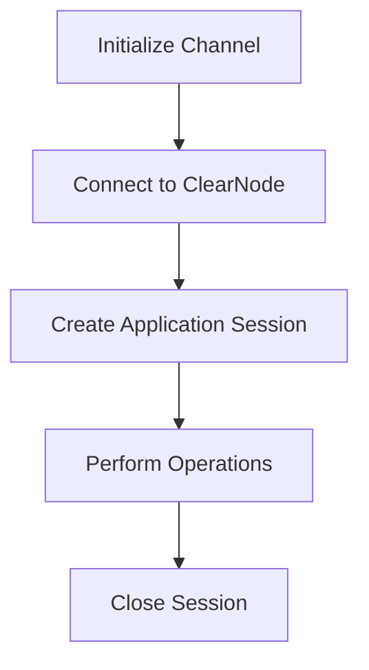

import Tabs from '@theme/Tabs';
import TabItem from '@theme/TabItem';

# Quick Start

**[Nitrolite](https://www.npmjs.com/package/@erc7824/nitrolite)** is our official SDK for creating high-performance decentralized applications. It provides a comprehensive set of functions and types to establish WebSocket connections with ClearNode and manage application sessions.

## Prerequisites

Before you begin working with Nitrolite, ensure that you have:

- **Node.js**: Version 16 or later
- **Package Manager**: npm, yarn, or pnpm
- **Development Environment**: 
  - For frontend: React, Vue, or similar framework
  - For backend: Node.js environment
- **Channel Setup**: Create a channel from your account at [apps.yellow.com](https://apps.yellow.com)

## Installation

You can install Nitrolite using your preferred package manager:

<Tabs>
  <TabItem value="npm" label="npm">

  ```bash
  npm install @erc7824/nitrolite
  ```

  </TabItem>
  <TabItem value="yarn" label="yarn">

  ```bash
  yarn add @erc7824/nitrolite
  ```

  </TabItem>
  <TabItem value="pnpm" label="pnpm">

  ```bash
  pnpm add @erc7824/nitrolite
  ```

  </TabItem>
</Tabs>


## ClearNode WebSocket

**ClearNode WebSocket URL**: `wss://clearnet.yellow.com/ws`


## Build with AI
We have generated a [llms-full.txt](https://erc7824.org/llms-full.txt) file that converts all our documentation into a single markdown document following the https://llmstxt.org/ standard.


## Complete Workflow



## Next steps

Building applications with Nitrolite involves these key steps:

1. **[Channel Creation](initializing_channel)**: Create a channel from your account at apps.yellow.com
2. **[ClearNode Connection](connect_to_the_clearnode)**: Establish WebSocket connection for off-chain messaging
3. **[Application Sessions](application_session)**: Create sessions to run specific applications
4. **[Session Closure](close_session)**: Properly close application sessions when finished

We recommend working through these guides in sequence to understand the complete application workflow. Each guide builds on concepts from previous sections.

Start with the [Channel Creation](initializing_channel) guide to begin your journey with Nitrolite applications.
